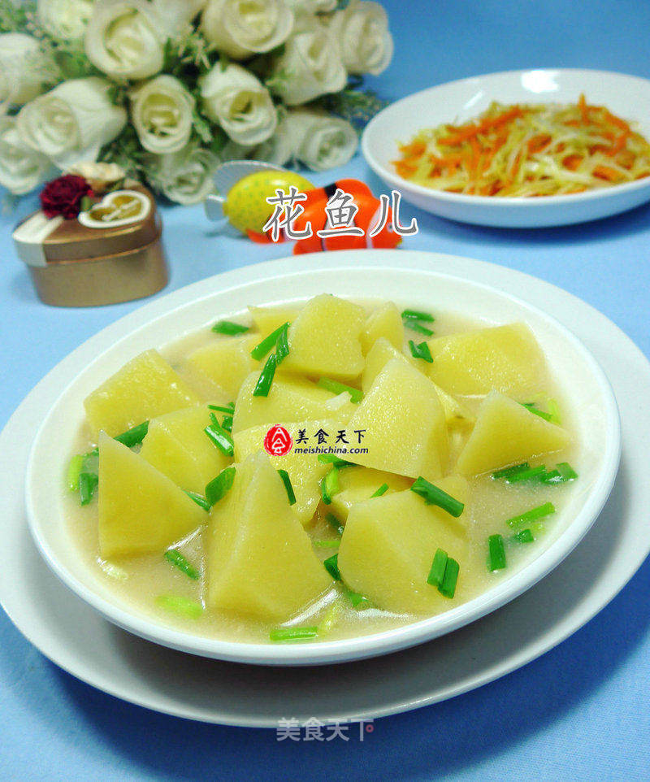

# 浓汤宝土豆块

## 📋 基本資訊 / Recipe Overview
- **料理名稱**：浓汤宝土豆块
- **原始標題**：浓汤宝土豆块
- **素食流派 / Diet**：全素 Vegan
- **料理分類 / Category**：养生汤品
- **來源平台 / Source**：[美食天下 · 精華素食專區](https://home.meishichina.com/recipe-229700.html)

## 🌿 食材及佐料清單 / Ingredients
- 土豆 310克 (主料)
- 葱段 适量 (辅料)
- 浓汤宝 1盒 (辅料)

## 🍳 烹飪步驟 / Step-by-Step Cooking Steps
1. 食材：土豆、浓汤宝、葱段
2. 将土豆清洗一下、去皮。
3. 放在案板上切成块。
4. 烧锅倒油烧热，下入切好的土豆翻炒翻炒。
5. 接着，搁入浓汤宝。
6. 加入适量的清水煮开。
7. 煮至土豆熟软。
8. 然后，搁入葱段，即成。

---
*食譜歸檔時間：2026-08-20 · 來源：美食天下 (home.meishichina.com)*