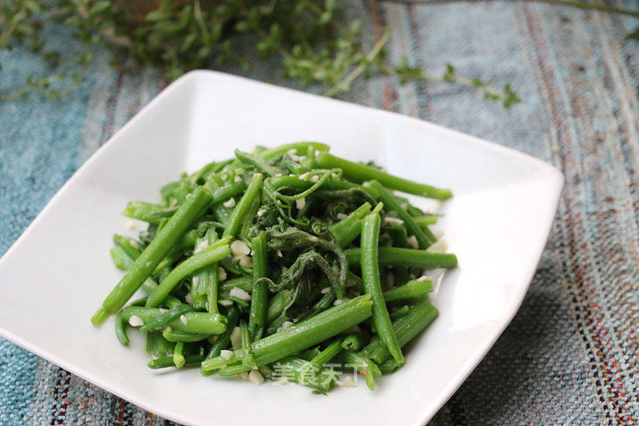

# 清炒南瓜藤

## 📋 基本資訊 / Recipe Overview
- **料理名稱**：清炒南瓜藤
- **原始標題**：清炒南瓜藤
- **素食流派 / Diet**：全素 Vegan
- **料理分類 / Category**：家常蔬食 / 经典热菜
- **來源平台 / Source**：[美食天下 · 精華素食專區](https://home.meishichina.com/recipe-232068.html)

## 🌿 食材及佐料清單 / Ingredients
- 南瓜藤 适量 (主料)
- 大蒜 适量 (主料)
- 盐 适量 (辅料)
- 鸡精 适量 (辅料)

## 🍳 烹飪步驟 / Step-by-Step Cooking Steps
1. 南瓜藤剥去外层老筋，掰小段洗净。大蒜切碎。
2. 锅中放少许油，加入大蒜碎煸香。
3. 加入南瓜藤炒软。
4. 加入盐和鸡精调味。

---
*食譜歸檔時間：2026-08-20 · 來源：美食天下 (home.meishichina.com)*