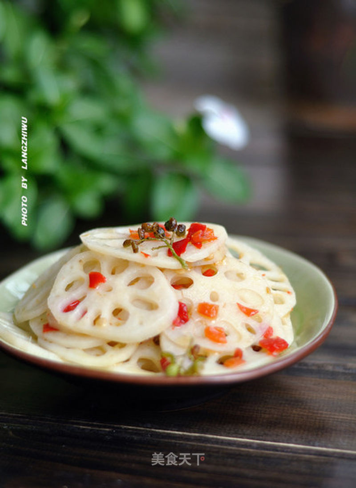

# 炝炒椒香藕片

## 📋 基本資訊 / Recipe Overview
- **料理名稱**：炝炒椒香藕片
- **原始標題**：炝炒椒香藕片
- **素食流派 / Diet**：全素 Vegan
- **料理分類 / Category**：家常蔬食 / 经典热菜
- **來源平台 / Source**：[美食天下 · 精華素食專區](https://home.meishichina.com/recipe-82535.html)

## 🌿 食材及佐料清單 / Ingredients
- 藕 适量 (主料)
- 鲜花椒 适量 (辅料)
- 油 适量 (配料)
- 精盐 适量 (配料)
- 剁椒 适量 (配料)
- 生姜 适量 (配料)
- 白醋 适量 (配料)

## 🍳 烹飪步驟 / Step-by-Step Cooking Steps
1. 鲜藕打皮后切薄片。
2. 把切好的藕片用开水焯过后，过凉水。
3. 另起油锅，油热后放入鲜花椒、姜丝爆香。
4. 放入一汤匙剁椒，翻炒。
5. 倒入藕片，烹入白醋大火翻炒。
6. 入少许精盐，翻炒均匀后即可出锅。

---
*食譜歸檔時間：2026-08-20 · 來源：美食天下 (home.meishichina.com)*