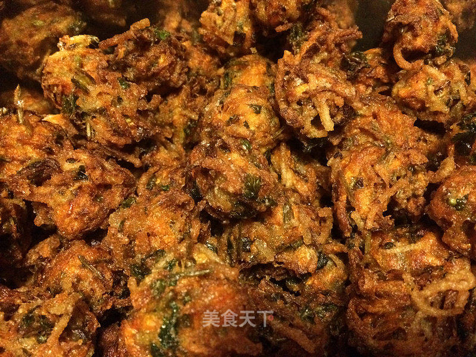

# 炸素丸子

## 📋 基本資訊 / Recipe Overview
- **料理名稱**：炸素丸子
- **原始標題**：炸素丸子
- **素食流派 / Diet**：全素 Vegan
- **料理分類 / Category**：面食主食
- **來源平台 / Source**：[美食天下 · 精華素食專區](https://home.meishichina.com/recipe-201604.html)

## 🌿 食材及佐料清單 / Ingredients
- 胡萝卜 5根 (主料)
- 红薯粉条 300克 (主料)
- 面粉 400克 (主料)
- 食用油 1000克 (主料)
- 五香粉 1袋 (辅料)
- 葱 1棵 (辅料)
- 香菜 200克 (辅料)
- 盐 10克 (辅料)

## 🍳 烹飪步驟 / Step-by-Step Cooking Steps
1. 胡萝卜洗净，去皮。
2. 擦成丝
3. 香菜洗净，切碎。
4. 红薯粉条煮熟
5. 加入所有调料拌匀
6. 油温7成热，下锅炸制。
7. 炸到丸子浮起，外壳金黄即可

---
*食譜歸檔時間：2026-08-20 · 來源：美食天下 (home.meishichina.com)*