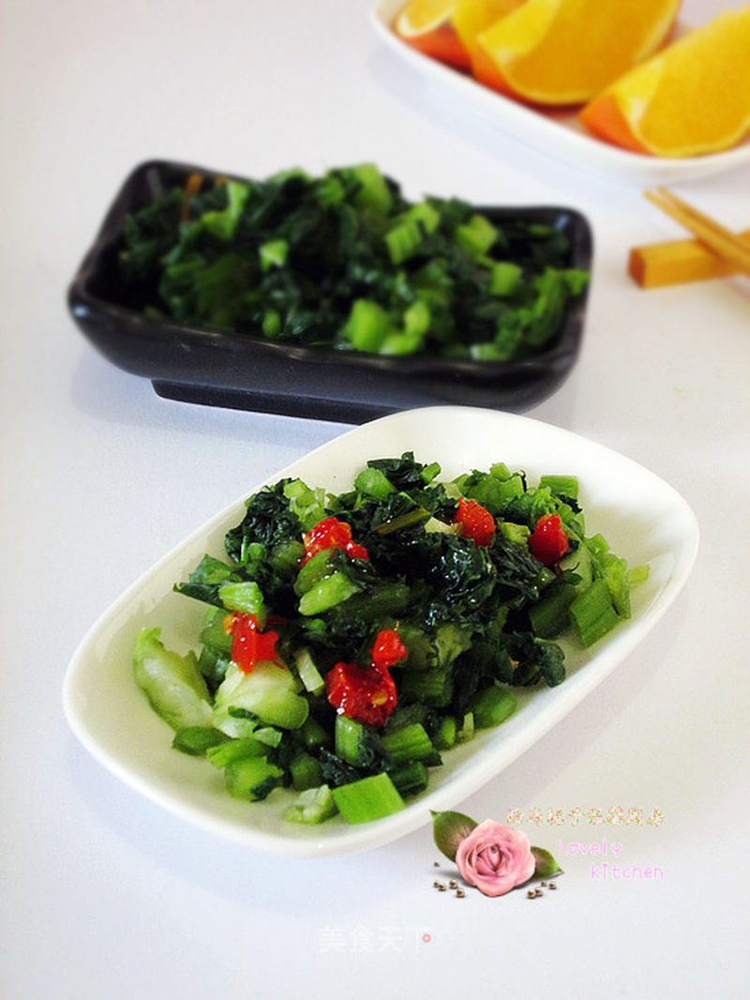

# 爆腌雪里

## 📋 基本資訊 / Recipe Overview
- **料理名稱**：爆腌雪里
- **原始標題**：爆腌雪里
- **素食流派 / Diet**：全素 Vegan
- **料理分類 / Category**：爽口凉菜
- **來源平台 / Source**：[美食天下 · 精華素食專區](https://home.meishichina.com/recipe-152417.html)

## 🌿 食材及佐料清單 / Ingredients
- 雪里蕻 500克， (主料)
- 腌菜盐 100克， (辅料)
- 香油 适量 (配料)
- 香醋 适量 (配料)
- 泡椒 适量 (配料)

## 🍳 烹飪步驟 / Step-by-Step Cooking Steps
1. 新鲜的雪里蕻在通风处晾晒一会，使水分挥发。
2. 把雪里蕻冲洗干净后沥干水分。
3. 准备一个稍大点的盆，放入一层雪里蕻。
4. 再撒上一层盐，以此类推
5. 腌制3天，中途要勤翻到，使雪里蕻的辣气挥发。
6. 将腌制好的雪里蕻放入容器中，倒入腌制出的汤汁。随吃随取。
7. 腌制的雪里蕻冲去盐分，切成碎粒。
8. 加入香油和香醋搅拌均匀即可。

---
*食譜歸檔時間：2026-08-20 · 來源：美食天下 (home.meishichina.com)*