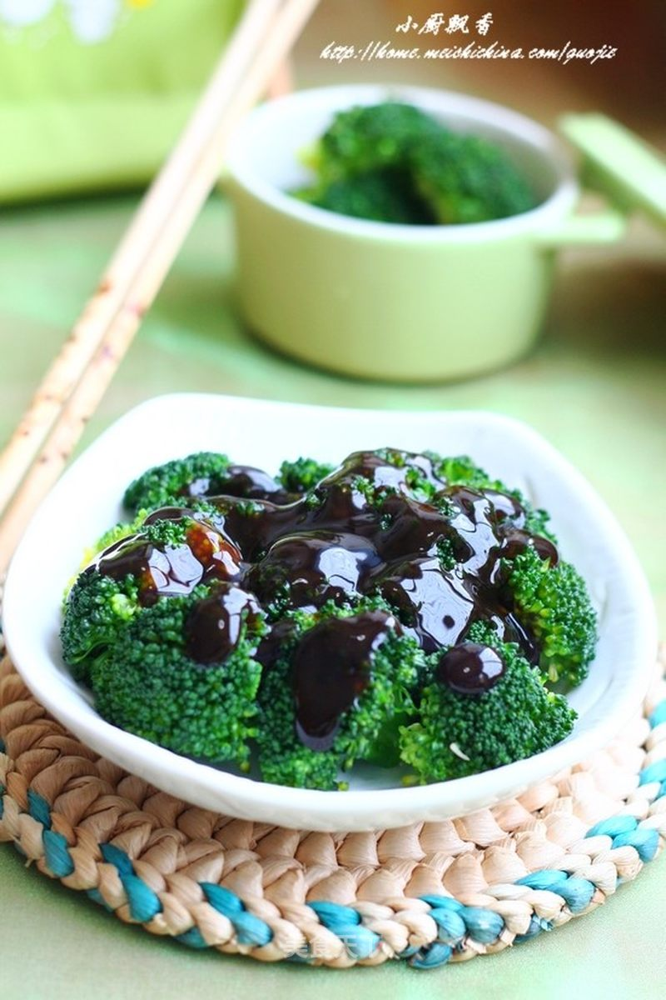

# 爱心调出幸福味

## 📋 基本資訊 / Recipe Overview
- **料理名稱**：爱心调出幸福味
- **原始標題**：【蚝油西兰花】爱心调出幸福味
- **素食流派 / Diet**：全素 Vegan
- **料理分類 / Category**：家常蔬食 / 经典热菜
- **來源平台 / Source**：[美食天下 · 精華素食專區](https://home.meishichina.com/recipe-103959.html)

## 🌿 食材及佐料清單 / Ingredients
- 西兰花 一棵 (主料)
- 李锦记蚝油 适量 (辅料)
- 盐 适量 (配料)
- 色拉油 适量 (配料)

## 🍳 烹飪步驟 / Step-by-Step Cooking Steps
1. 准备好材料。
2. 将西兰花切成小朵。冲洗干净。
3. 沸水中加少许盐和油，倒入西兰花，焯1-2分钟捞起。
4. 盛出后用冷水冲至变凉。
5. 摆在盘中。
6. 将李锦记蚝油浇在西兰花上。简单美味的蚝油西兰花做好了

---
*食譜歸檔時間：2026-08-20 · 來源：美食天下 (home.meishichina.com)*