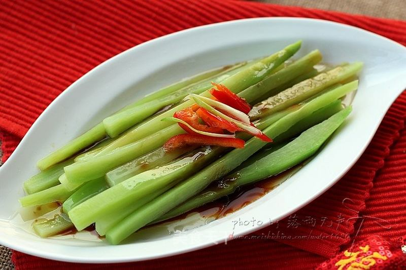

# 爽脆清嫩——白灼芥兰

## 📋 基本資訊 / Recipe Overview
- **料理名稱**：爽脆清嫩——白灼芥兰
- **原始標題**：爽脆清嫩——白灼芥兰
- **素食流派 / Diet**：全素 Vegan
- **料理分類 / Category**：家常蔬食 / 经典热菜
- **來源平台 / Source**：[美食天下 · 精華素食專區](https://home.meishichina.com/recipe-110798.html)

## 🌿 食材及佐料清單 / Ingredients
- 芥兰 1根（粗） (主料)
- 红椒丝 适量 (主料)
- 葱丝 适量 (主料)
- 蚝油 1勺 (辅料)
- 蒸鱼豉油 2勺 (辅料)
- 食用油 适量 (辅料)

## 🍳 烹飪步驟 / Step-by-Step Cooking Steps
1. 准备一根粗芥兰
2. 剥皮切两段
3. 切成长条状
4. 锅里水烧开，加点食用油，将芥兰条放沸水里焯煮2分钟
5. 这时在碗里加一勺蚝油和2大勺蒸鱼豉油
6. 将芥兰捞起冷水冲冲捞出摆盘，将凋好的料汁倒在上面
7. 锅里油烧热，放入葱丝爆香
8. 芥兰上摆一点红椒丝和葱白丝，将油淋在上面即可。

---
*食譜歸檔時間：2026-08-20 · 來源：美食天下 (home.meishichina.com)*