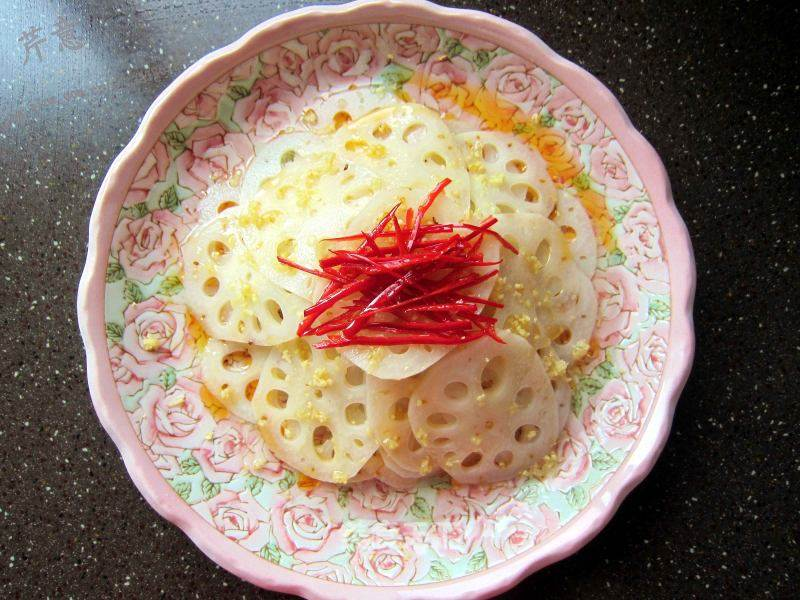

# 珊瑚藕片

## 📋 基本資訊 / Recipe Overview
- **料理名稱**：珊瑚藕片
- **原始標題**：珊瑚藕片
- **素食流派 / Diet**：全素 Vegan
- **料理分類 / Category**：家常蔬食 / 经典热菜
- **來源平台 / Source**：[美食天下 · 精華素食專區](https://home.meishichina.com/recipe-106028.html)

## 🌿 食材及佐料清單 / Ingredients
- 莲藕 1节 (主料)
- 红辣椒 1根 (辅料)
- 麻辣油 2大勺 (配料)
- 糖 3大勺 (配料)
- 米醋 1大勺 (配料)
- 姜 1小块儿 (配料)

## 🍳 烹飪步驟 / Step-by-Step Cooking Steps
1. 辣椒切细丝，姜切末备用；
2. 莲藕洗净去皮，顶刀切成薄片；
3. 切好的藕片马上放到加入几滴白醋（分量外）的清水中，浸泡5、6分钟；
4. 同时起锅，坐水烧开，待水沸腾后下入藕片，略一汆烫；
5. 迅速捞出藕片，过凉后放进冰过的凉开水中，冰至凉透；
6. 捞出，沥干水分；
7. 摆盘；
8. 先撒姜丝，再摆上一半的红辣椒丝；
9. 糖和米醋加在一起，搅拌均匀；
10. 浇在藕片上；
11. 小锅置火上，加入麻辣油，投入剩下的红辣椒丝，小火炸至辣椒丝微微变干；
12. 趁热将辣油浇在藕片上，用一个大盆扣住，略焖一会儿即可。

---
*食譜歸檔時間：2026-08-20 · 來源：美食天下 (home.meishichina.com)*