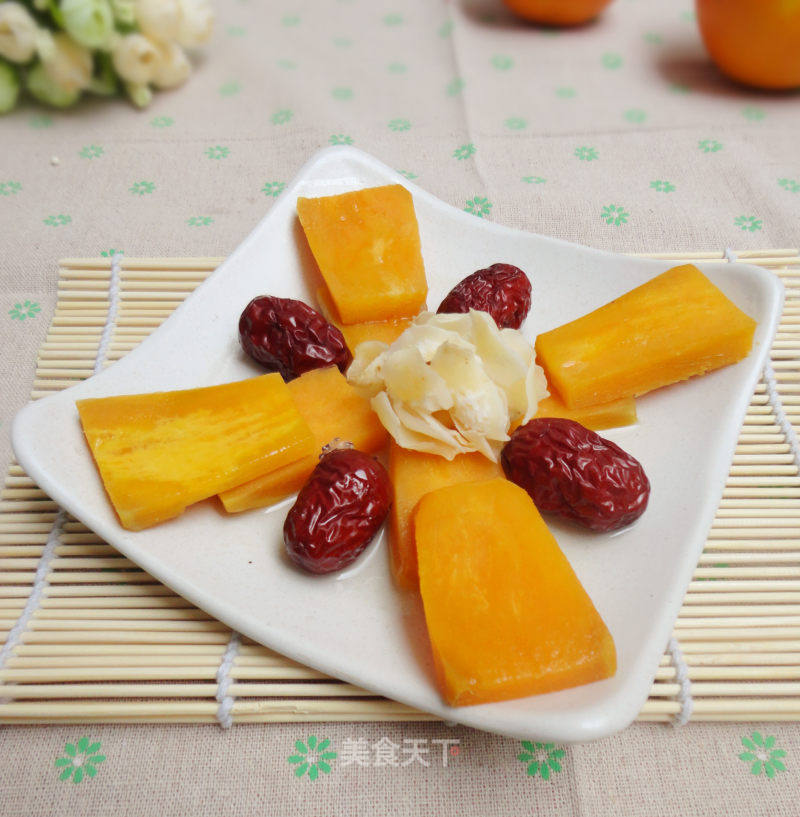

# 甜蜜蜜红薯

## 📋 基本資訊 / Recipe Overview
- **料理名稱**：甜蜜蜜红薯
- **原始標題**：甜蜜蜜红薯
- **素食流派 / Diet**：全素 Vegan
- **料理分類 / Category**：家常蔬食 / 经典热菜
- **來源平台 / Source**：[美食天下 · 精華素食專區](https://home.meishichina.com/recipe-146634.html)

## 🌿 食材及佐料清單 / Ingredients
- 红薯 适量 (主料)
- 红枣 适量 (辅料)
- 百合 适量 (辅料)
- 冰糖 适量 (配料)

## 🍳 烹飪步驟 / Step-by-Step Cooking Steps
1. 准备红薯、红枣、干百合、冰糖
2. 红薯削皮后用清水泡着以防氧化
3. 红薯切片
4. 干百合下沸水中煮一下，容易蒸透
5. 红薯、红枣、百合整齐麻烦在碟子上，往红薯上放小粒冰糖
6. 放到锅里盖锅盖蒸至冰糖融化，红薯熟透
7. 甜蜜蜜红薯蒸好了

---
*食譜歸檔時間：2026-08-20 · 來源：美食天下 (home.meishichina.com)*