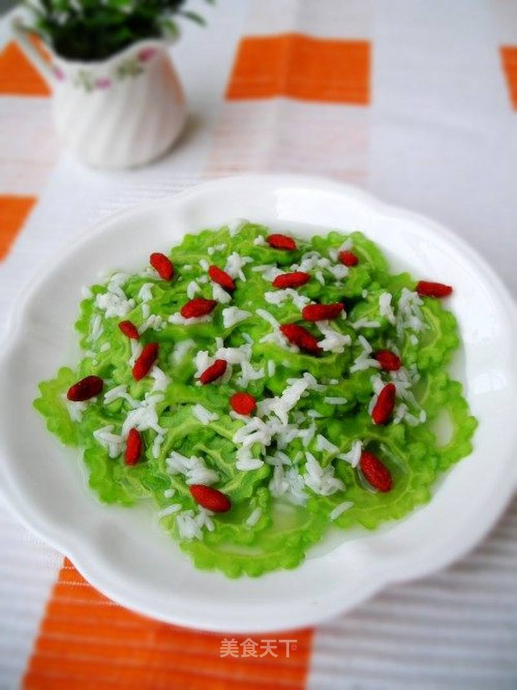

# 甜酒酿泡苦瓜

## 📋 基本資訊 / Recipe Overview
- **料理名稱**：甜酒酿泡苦瓜
- **原始標題**：甜酒酿泡苦瓜
- **素食流派 / Diet**：全素 Vegan
- **料理分類 / Category**：家常蔬食 / 经典热菜
- **來源平台 / Source**：[美食天下 · 精華素食專區](https://home.meishichina.com/recipe-83208.html)

## 🌿 食材及佐料清單 / Ingredients
- 苦瓜 一个 (主料)
- 甜酒酿 半碗 (辅料)
- 枸杞 10克 (辅料)
- 盐 适量 (配料)

## 🍳 烹飪步驟 / Step-by-Step Cooking Steps
1. 准备好材料
2. 苦瓜洗干净切成圈
3. 将切好的苦瓜撒上盐，拌匀，腌二十分钟
4. 将腌好的苦瓜沥干水，放开水中焯水
5. 苦瓜变色后即可捞出沥干水，晾凉
6. 晾凉的苦瓜淋上甜酒酿，撒上洗干净的枸杞，放冰箱冰镇30分钟即可食用

---
*食譜歸檔時間：2026-08-20 · 來源：美食天下 (home.meishichina.com)*