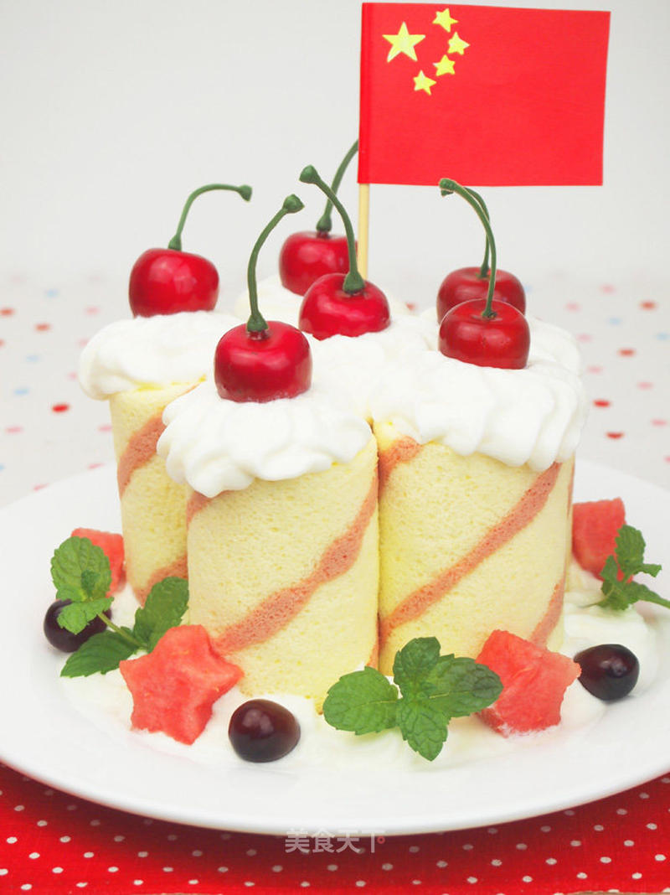

# 用蛋糕卷演绎祝福蛋糕：加油，中国！

## 📋 基本資訊 / Recipe Overview
- **料理名稱**：用蛋糕卷演绎祝福蛋糕：加油，中国！
- **原始標題**：用蛋糕卷演绎祝福蛋糕：加油，中国！
- **素食流派 / Diet**：蛋奶素 Ovo-Lacto
- **料理分類 / Category**：面食主食
- **來源平台 / Source**：[美食天下 · 精華素食專區](https://home.meishichina.com/recipe-80968.html)

## 🌿 食材及佐料清單 / Ingredients
- 鸡蛋 4个 (主料)
- 低筋面粉 80克 (主料)
- 细砂糖 50克 10克 (辅料)
- 色拉油 50克 (辅料)
- 纯牛奶 65克 (辅料)
- 盐 1克 (辅料)
- 红曲粉 1/8小勺 (辅料)
- 果酱 80克 (配料)

## 🍳 烹飪步驟 / Step-by-Step Cooking Steps
1. 用分蛋器把蛋白、蛋黄分开（图1），注意分蛋时不要让蛋白沾到一丝蛋黄。
2. 分别将蛋白、蛋黄倒入打蛋盆（图2），打蛋盆要保证无水无油。装蛋白的盆要稍大些。此次蛋白盆为20CM不锈钢加深盆，蛋黄盆18CM。
3. 将1克盐放入蛋黄盆（图3）。盐可以让糖的甜味不那么腻。再加入10克细砂糖。用手动打蛋器搅打均匀。
4. 将50克色拉油分三次加入，每次加入都要用手动打蛋器搅打均匀（图4）。
5. 将65克纯牛奶倒入蛋黄盆中（图5），搅打均匀至油水融合。
6. 将80克低粉筛入蛋黄盆中（图6）。
7. 搅拌均匀至无颗粒的浆糊状（图7）。
8. 用勺子取20克蛋黄糊于小碗中（图8）。
9. 将1/8小勺红曲粉筛入小碗中（图9），用勺子切拌均匀。
10. 这样我们就得到了两种不同颜色的蛋黄糊（图10），将两种蛋黄糊放置一旁备用。
11. 用电动打蛋器将蛋白打散，加入5滴柠檬汁（图11）。
12. 搅打至（图12）所示呈鱼眼泡状时，加入50克的细砂糖三分之一（17克）。
13. 打至蛋白开始变浓稠，体积膨大一倍，呈（图13）所示细密泡沫时，再加入三分之一的细砂糖（17克）。
14. 继续搅打至蛋白比较浓稠，表面起纹路，打蛋器上的蛋白尖峰下垂时（图14），加入剩下的细砂糖（16克）。
15. 继续搅打，打蛋器上的蛋白尖峰长而不挺立（图15），表示已经到了湿性发泡的程度，也就是九分发的程度。做戚风蛋糕卷，蛋白打到这个程度就可以了。
16. 此时蛋白虽有纹路，但是手感较轻，较软。盆内的蛋白呈弯曲的尖角状（图16）。
17. 取约为红曲蛋黄糊两倍的蛋白于小碗内（图17）。
18. 用勺子翻拌及切拌，直至蛋白与红曲蛋黄糊完全融合（图18）。混合好的面糊呈比较浓稠的均匀的浅红色。
19. 取一个小号裱花袋，装在广口玻璃瓶里，高出瓶口的部分外翻在瓶外。将红曲蛋糕糊倒到裱花袋内（图19）。
20. 将裱花袋敞口端捥一个结，用剪刀在裱花袋细端剪一个小口。烤盘内铺好油纸，手握裱花袋在油纸上画出细长线（图21）。放入180℃预热好的烤箱，烤一分钟，定型。
21. 定型的同时，抓紧时间制作原味蛋糕糊。取三分之一打发好的蛋白到原味蛋黄糊中（图21）。
22. 用橡皮刮刀翻拌均匀（图22）。注意要从底部往上翻拌，就象炒菜一样，不要划圈搅拌，以免蛋白消泡。也可以用切拌的方法。
23. 把拌好的面糊倒入蛋白盆内（图23）。
24. 用同样的手法翻拌及切拌，直至蛋白与蛋黄糊完全融合（图25），混合好的面糊呈比较浓稠的均匀的浅黄色。
25. 将切拌好的原味蛋糕糊倒入烤好定型的细长线上（图25）。用橡皮刮刀将蛋糕糊抹平，双手持烤盘，轻摔几次，震去大气泡。放入已经预热好的烤箱中下层，180度烤21分钟。
26. 将烤盘从烤箱取出。双手拎着两边的油纸，将蛋糕拎出烤盘，放在凉网上，小心剥开四周的油纸。在另一个凉网上铺一张油纸，将蛋糕倒扣在新油纸上，并揭去原来的油纸（图26）。
27. 在第一个凉网铺一张新油纸，将揭去油纸的蛋糕再次倒扣在新油纸上。现在蛋糕烤黄的那面向上。用细锯齿刀将蛋糕一分为二（图27）。
28. 将草莓果酱均匀地抹在蛋糕表面（图28）。用擀面杖卷着油纸，把蛋糕卷起来。
29. 卷好后定型10分钟（图29）。
30. 打开油纸，切去两头不规则部分，然后等分为六份（图30）。将蛋糕卷竖立在白瓷盘上，用打发好的鲜奶油、水果装饰即可。
31. 将蛋糕卷竖立在白瓷盘上，用打发好的鲜奶油、水果装饰即可。

---
*食譜歸檔時間：2026-08-20 · 來源：美食天下 (home.meishichina.com)*