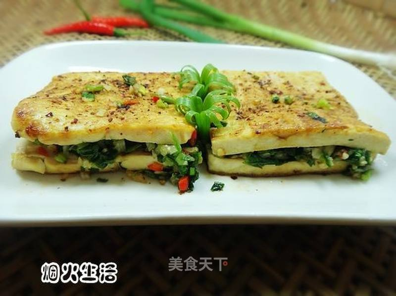

# 电饼铛烤傣味豆腐

## 📋 基本資訊 / Recipe Overview
- **料理名稱**：电饼铛烤傣味豆腐
- **原始標題**：电饼铛烤傣味豆腐
- **素食流派 / Diet**：全素 Vegan
- **料理分類 / Category**：面食主食
- **來源平台 / Source**：[美食天下 · 精華素食專區](https://home.meishichina.com/recipe-91388.html)

## 🌿 食材及佐料清單 / Ingredients
- 豆腐 一块 (主料)
- 小葱 三根 (辅料)
- 香菜 一根 (辅料)
- 小米辣 2个 (辅料)
- 蒜 一头 (辅料)
- 糊辣椒面 适量 (辅料)
- 花椒粉 适量 (辅料)
- 生抽 适量 (辅料)
- 味精 适量 (辅料)
- 盐 适量 (辅料)

## 🍳 烹飪步驟 / Step-by-Step Cooking Steps
1. 蒜去皮，剁碎。小米辣也剁碎。
2. 葱、香菜洗净，切碎。
3. 把蒜、小米辣、葱、香菜放入碗中，加入盐、生抽、味精拌匀。
4. 把豆腐切成一厘米厚的块，再从中间块成连片成豆腐夹。
5. 把拌好的调料放入豆腐夹内。
6. 把糊辣椒粉、花椒粉、粉末味精放入小碗内拌匀备用。
7. 电饼铛放入少量油预热，放入豆腐块煎。
8. 一面煎黄翻过来煎另一面。
9. 煎黄的一面刷上一些生抽。
10. 然后再刷上拌好的辣椒面，翻过来另一面也刷上生抽和辣椒面即可食用。

---
*食譜歸檔時間：2026-08-20 · 來源：美食天下 (home.meishichina.com)*