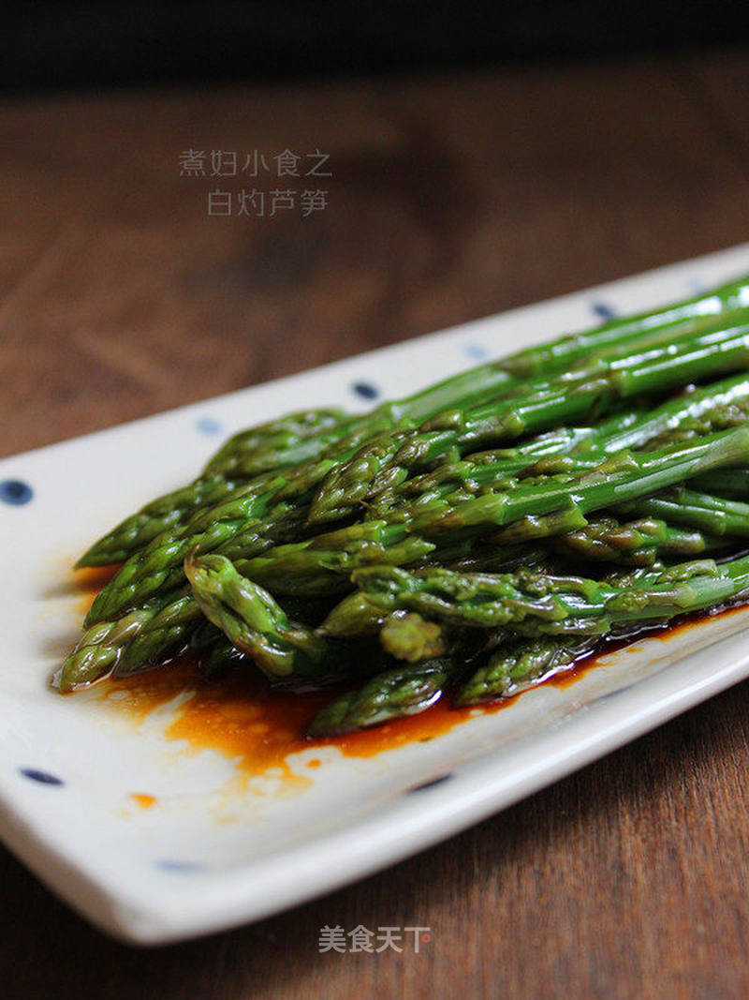

# 白灼芦笋

## 📋 基本資訊 / Recipe Overview
- **料理名稱**：白灼芦笋
- **原始標題**：白灼芦笋
- **素食流派 / Diet**：全素 Vegan
- **料理分類 / Category**：家常蔬食 / 经典热菜
- **來源平台 / Source**：[美食天下 · 精華素食專區](https://home.meishichina.com/recipe-223328.html)

## 🌿 食材及佐料清單 / Ingredients
- 芦笋 250克 (主料)
- 蚝油 10ml (主料)
- 食用油 2大勺 (主料)
- 生抽 10ml (辅料)
- 清水 10ml (辅料)

## 🍳 烹飪步驟 / Step-by-Step Cooking Steps
1. 芦笋水中浸泡片刻，冲洗干净。
2. 将根部老硬的部分去掉。
3. 烧一锅水，加一勺盐。
4. 将洗好的芦笋倒入锅中烫1至2分钟，根据芦笋的大小，熟了就行了。
5. 烫好的芦笋放入冰水中过凉后沥水。
6. 将生抽，蚝油和清水倒在容器中调匀。
7. 锅中加入2勺油，微烧热后，将调好的料汁倒入锅中沸起盛出。
8. 做好的料汁
9. 均匀的浇在摆好盘的芦笋上就可以了。
10. 成品

---
*食譜歸檔時間：2026-08-20 · 來源：美食天下 (home.meishichina.com)*