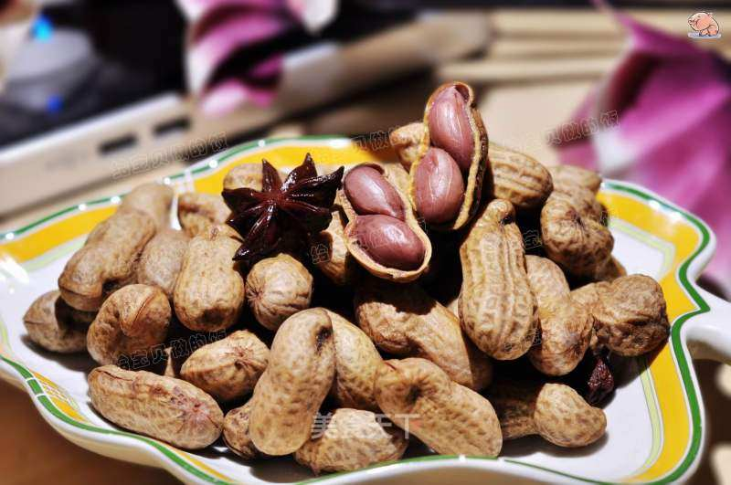

# 盐水花生

## 📋 基本資訊 / Recipe Overview
- **料理名稱**：盐水花生
- **原始標題**：盐水花生
- **素食流派 / Diet**：全素 Vegan
- **料理分類 / Category**：家常蔬食 / 经典热菜
- **來源平台 / Source**：[美食天下 · 精華素食專區](https://home.meishichina.com/recipe-91648.html)

## 🌿 食材及佐料清單 / Ingredients
- 鲜花生 适量 (主料)
- 花椒 适量 (主料)
- 八角 适量 (主料)
- 盐 适量 (主料)

## 🍳 烹飪步驟 / Step-by-Step Cooking Steps
1. 周日领着女儿去采摘园里刨的紫皮的花生。
2. 花生彻底清洗干净，有很多泥沙。
3. 捏开一个小口，方便入味。（呵呵主要是花生不多，我闲着也没事，如嫌麻烦此步也可忽略）
4. 在锅中加入适量水（我用的电压力锅），放入花生，花椒，八角和盐压15分钟。
5. 压好后再焖三个小时即可食用。
6. 成品图

---
*食譜歸檔時間：2026-08-20 · 來源：美食天下 (home.meishichina.com)*