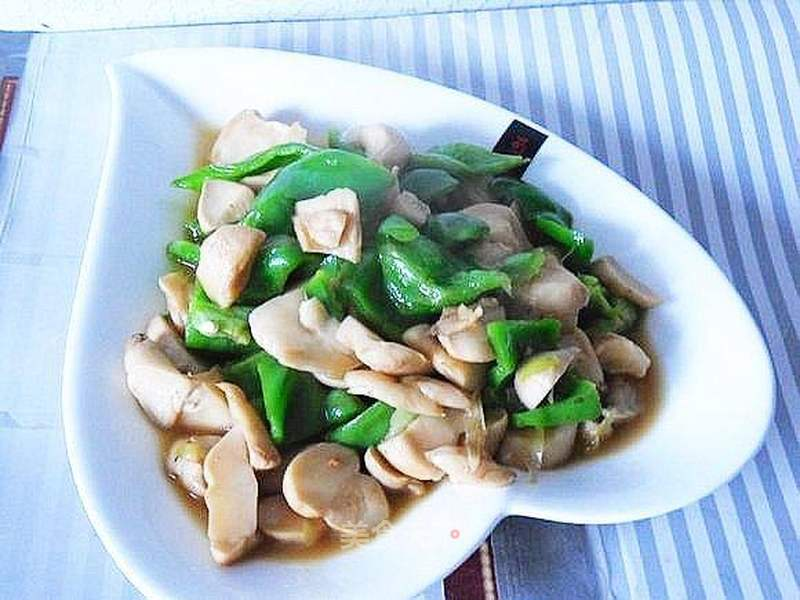

# 素炒杏鲍菇

## 📋 基本資訊 / Recipe Overview
- **料理名稱**：素炒杏鲍菇
- **原始標題**：素炒杏鲍菇
- **素食流派 / Diet**：全素 Vegan
- **料理分類 / Category**：家常蔬食 / 经典热菜
- **來源平台 / Source**：[美食天下 · 精華素食專區](https://home.meishichina.com/recipe-201432.html)

## 🌿 食材及佐料清單 / Ingredients
- 杏鲍菇 200克 (主料)
- 青椒 200克 (主料)
- 油 适量 (辅料)
- 盐 适量 (辅料)
- 生抽 适量 (辅料)
- 味精 适量 (辅料)
- 葱 适量 (辅料)

## 🍳 烹飪步驟 / Step-by-Step Cooking Steps
1. 主辅料：杏鲍菇、青椒把杏鲍菇洗净、切片。青椒切片。
2. 锅烧开水，放入杏鲍菇焯熟。然后将其过冷水，沥干水分，备用。
3. 起锅热油，放入葱花炒香。
4. 放入备用的杏鲍菇翻炒。加入生抽、盐调味。
5. 加适量水。烧开后，小火烧制5分钟，使其入味。
6. 放入青椒片。
7. 加味精提鲜。翻炒均匀，即可关火。
8. 出锅装盘。

---
*食譜歸檔時間：2026-08-20 · 來源：美食天下 (home.meishichina.com)*