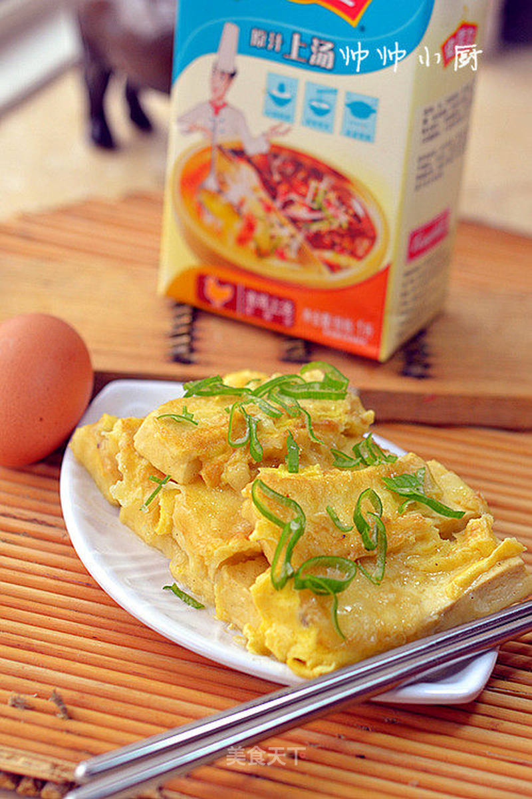

# 素食精選料理

## 📋 基本資訊 / Recipe Overview
- **料理名稱**：素食精選料理
- **原始標題**：【鸡汁锅塌豆腐】
- **素食流派 / Diet**：蛋素 Ovo-Vegetarian
- **料理分類 / Category**：面食主食
- **來源平台 / Source**：[美食天下 · 精華素食專區](https://home.meishichina.com/recipe-104868.html)

## 🌿 食材及佐料清單 / Ingredients
- 豆腐 适量 (主料)
- 鸡蛋 适量 (主料)
- 鸡汤 适量 (主料)
- 淀粉 适量 (主料)
- 葱花 适量 (辅料)
- 盐和鸡精 适量 (配料)
- 胡椒粉 适量 (配料)
- 料酒 适量 (配料)

## 🍳 烹飪步驟 / Step-by-Step Cooking Steps
1. 准备原料
2. 豆腐切块加胡椒粉和适量盐，料酒腌制15分钟
3. 豆腐裹上淀粉
4. 蘸上大好的蛋液
5. 下锅煎到两面焦黄（这次我试了下一面煎的，没有两面的有卖相）
6. 之后倒入剩余的蛋液
7. 加入鸡汤没过食材
8. 中火煨烧直至汤汁浓稠，中间用叉子叉便于入味。

---
*食譜歸檔時間：2026-08-20 · 來源：美食天下 (home.meishichina.com)*