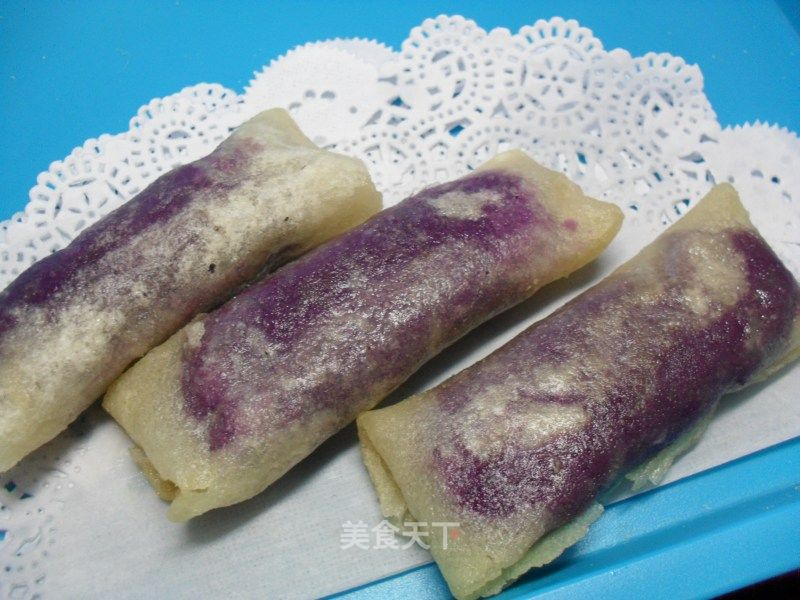

# 紫薯春卷

## 📋 基本資訊 / Recipe Overview
- **料理名稱**：紫薯春卷
- **原始標題**：紫薯春卷
- **素食流派 / Diet**：奶素 Lacto-Vegetarian
- **料理分類 / Category**：面食主食
- **來源平台 / Source**：[美食天下 · 精華素食專區](https://home.meishichina.com/recipe-104061.html)

## 🌿 食材及佐料清單 / Ingredients
- 紫薯 4小个 (主料)
- 春卷皮 15张 (主料)
- 黄油 30克 (辅料)
- 炼乳 2勺 (辅料)
- 生粉 2勺 (辅料)
- 牛奶 适量 (辅料)

## 🍳 烹飪步驟 / Step-by-Step Cooking Steps
1. 准备所需材料紫薯4小个，黄油30克，炼乳2勺，牛奶适量，生粉2勺，春卷皮15张
2. 紫薯微博叮熟，剥皮，捣成泥
3. 紫薯泥加炼乳，牛奶放料理机打成幼滑的浆
4. 用筛子将紫薯浆过滤一下，这样会很细腻
5. 锅中放黄油融化
6. 倒入紫薯泥中火翻炒
7. 生粉加少许水调成水淀粉
8. 水淀粉加入紫薯泥，稍加翻炒，紫薯泥就完成了，炼乳有甜味所以不需要再加糖
9. 用少许面粉和水调和成薄面糊做粘合
10. 春卷皮铺盘中
11. 紫薯馅稍加整形，搓成长条放在春卷皮上
12. 卷起春卷皮，用面糊粘合，包成春卷
13. 锅中放油，七成热时，下入春卷
14. 煎成两面金黄即可

---
*食譜歸檔時間：2026-08-20 · 來源：美食天下 (home.meishichina.com)*