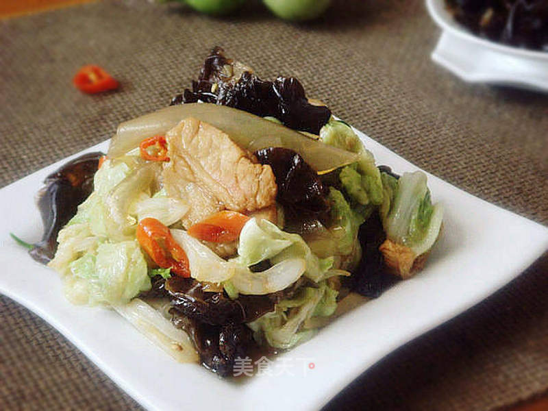

# 老厨白菜

## 📋 基本資訊 / Recipe Overview
- **料理名稱**：老厨白菜
- **原始標題**：老厨白菜
- **素食流派 / Diet**：全素 Vegan
- **料理分類 / Category**：面食主食
- **來源平台 / Source**：[美食天下 · 精華素食專區](https://home.meishichina.com/recipe-94575.html)

## 🌿 食材及佐料清單 / Ingredients
- 白菜 350克 (主料)
- 木耳 4朵 (主料)
- 粉皮 适量 (主料)
- 五花肉 适量 (主料)
- 葱 适量 (辅料)
- 姜 适量 (辅料)
- 红辣椒 适量 (辅料)
- 香菜 1棵 (辅料)
- 盐 适量 (配料)
- 生抽 适量 (配料)
- 老抽 适量 (配料)
- 醋 适量 (配料)
- 料酒 少许 (配料)
- 白糖 少许 (配料)

## 🍳 烹飪步驟 / Step-by-Step Cooking Steps
1. 将白菜洗净
2. 只取叶子部分，撕成大块
3. 木耳用凉水泡发
4. 去蒂洗净后撕成大朵状
5. 粉皮洗净用热水焯至滑软捞出
6. 放凉水中浸泡
7. 葱切葱花，姜切细丝
8. 鲜红辣椒切小圈，香菜切段
9. 五花肉切片
10. 生抽、老抽、料酒、醋调制成汁备用
11. 炒锅注油烧热放八角，放五花肉煸炒出香味
12. 再爆香葱、姜、红辣椒
13. 倒入白菜炒至软塌
14. 淋入调料汁
15. 加入木耳
16. 再倒入粉皮翻炒均匀
17. 加盐、白糖调味
18. 撒上香菜出锅即可

---
*食譜歸檔時間：2026-08-20 · 來源：美食天下 (home.meishichina.com)*