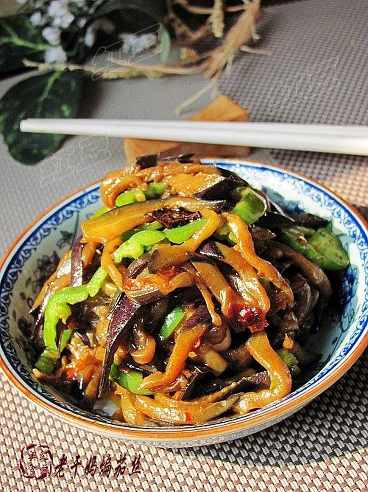

# 老干妈煸茄丝

## 📋 基本資訊 / Recipe Overview
- **料理名稱**：老干妈煸茄丝
- **原始標題**：老干妈煸茄丝
- **素食流派 / Diet**：全素 Vegan
- **料理分類 / Category**：家常蔬食 / 经典热菜
- **來源平台 / Source**：[美食天下 · 精華素食專區](https://home.meishichina.com/recipe-44506.html)

## 🌿 食材及佐料清單 / Ingredients
- 长茄子 500克 (主料)
- 青椒 2个 (辅料)
- 蒜瓣 5个 (辅料)
- 葱 适量 (配料)
- 姜 适量 (配料)
- 盐 适量 (配料)
- 老干妈香辣酱 20克 (配料)
- 酱油 10克 (配料)
- 糖 3克 (配料)
- 鸡精 适量 (配料)

## 🍳 烹飪步驟 / Step-by-Step Cooking Steps
1. 准备好所有的食材。
2. 茄子洗净切丝，加少许盐腌制5分钟。
3. 青椒洗净切丝，葱姜蒜切好。
4. 炒锅倒油烧热爆香葱姜蒜。
5. 放入老干妈香辣酱。
6. 翻炒出香味。
7. 倒入茄丝煸炒。
8. 切丝煸炒至软，在加入糖。
9. 加入酱油。
10. 加入青椒丝翻炒。
11. 加少许鸡精翻炒均匀关火。

---
*食譜歸檔時間：2026-08-20 · 來源：美食天下 (home.meishichina.com)*