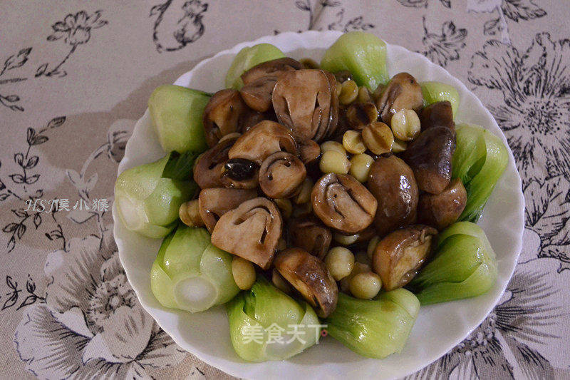

# 耗油烩鲜莲草菇

## 📋 基本資訊 / Recipe Overview
- **料理名稱**：耗油烩鲜莲草菇
- **原始標題**：耗油烩鲜莲草菇
- **素食流派 / Diet**：全素 Vegan
- **料理分類 / Category**：养生汤品
- **來源平台 / Source**：[美食天下 · 精華素食專區](https://home.meishichina.com/recipe-230912.html)

## 🌿 食材及佐料清單 / Ingredients
- 草菇 350g (主料)
- 带壳鲜莲子 250g (主料)
- 小包菜芯 10颗 (主料)
- 蒜瓣 2瓣 (主料)
- 盐 2g (辅料)
- 蚝油 3汤匙 (辅料)
- 食用油 3汤匙 (辅料)

## 🍳 烹飪步驟 / Step-by-Step Cooking Steps
1. 准备250饱满的带壳鲜莲子，大概就两饭碗那个量
2. 先把绿色厚皮剥开，里面有一层膜，撕开后就是平时看见的莲子，把里面的绿芯拿出来，莲子芯特别苦，不过很败火，吃得了的把芯一起吃更好
3. 准备个小碗装些水，剥好的莲子放水里，我剥了1个多小时，剥好放水里保证新鲜
4. 剥出一小碗的量
5. 锅里放几粒冰糖，水开后煮3分钟，新鲜莲子不用住太久，煮出来不太糯的，是清脆的
6. 草菇洗净
7. 对半切一刀
8. 小白菜洗净
9. 锅里放水，加一点盐和一点点油烧开放白菜焯15秒，放盐和油焯蔬菜可以让菜不容易变黄
10. 蒜瓣切片
11. 锅里水烧干再放食用油，马上放蒜片，蒜片变金黄时放入草菇翻炒，放2g盐
12. 放盐后草菇变软后加耗油
13. 加耗油后就可以加鲜莲子，翻炒均匀就可以出祸装盘了
14. 不要用太浅的盘子，装盘后2.3分钟草菇就会出水，太浅的盘子汁会溢出来
15. 成品

---
*食譜歸檔時間：2026-08-20 · 來源：美食天下 (home.meishichina.com)*