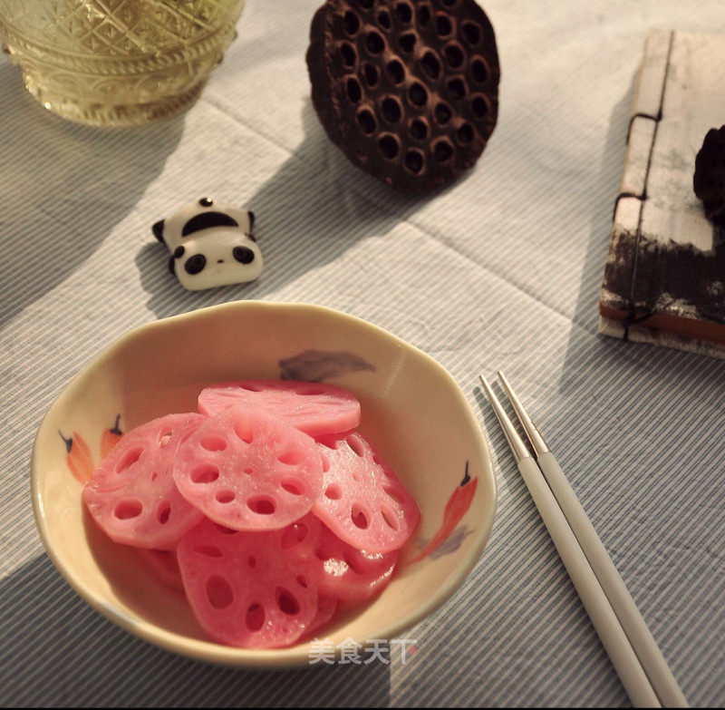

# 胭脂红藕

## 📋 基本資訊 / Recipe Overview
- **料理名稱**：胭脂红藕
- **原始標題**：胭脂红藕
- **素食流派 / Diet**：全素 Vegan
- **料理分類 / Category**：家常蔬食 / 经典热菜
- **來源平台 / Source**：[美食天下 · 精華素食專區](https://home.meishichina.com/recipe-232093.html)

## 🌿 食材及佐料清單 / Ingredients
- 藕 500克 (主料)
- 蔊菜 500克 (主料)
- 柠檬 1个 (辅料)
- 糖 20克 (辅料)
- 盐 2克 (辅料)

## 🍳 烹飪步驟 / Step-by-Step Cooking Steps
1. 准备材料
2. 红蔊菜洗干净备用
3. 将蔊菜煮出汁水
4. 用滤网滤出汁水
5. 藕削皮切片
6. 放入锅中汆一下水
7. 煮好的藕沥干水份
8. 蔊菜汁里放入糖、柠檬汁、少许盐搅拌均匀。
9. 藕片放入汁水中浸泡数小时
10. 红藕香残玉簟秋。轻解罗裳，独上兰舟。。。
11. 不忍入口😍
12. 美⋯⋯

---
*食譜歸檔時間：2026-08-20 · 來源：美食天下 (home.meishichina.com)*