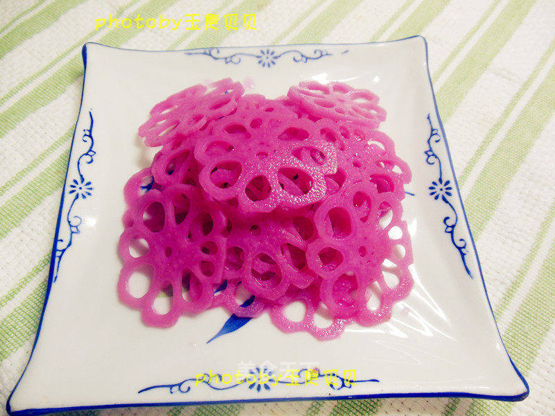

# 胭脂藕——美的闪眼

## 📋 基本資訊 / Recipe Overview
- **料理名稱**：胭脂藕——美的闪眼
- **原始標題**：胭脂藕——美的闪眼
- **素食流派 / Diet**：全素 Vegan
- **料理分類 / Category**：家常蔬食 / 经典热菜
- **來源平台 / Source**：[美食天下 · 精華素食專區](https://home.meishichina.com/recipe-84443.html)

## 🌿 食材及佐料清單 / Ingredients
- 藕 1根 (主料)
- 苋菜 500克 (辅料)
- 白醋 适量 (配料)
- 白糖 适量 (配料)

## 🍳 烹飪步驟 / Step-by-Step Cooking Steps
1. 材料：藕1根，白醋50调羹，白糖50克，苋菜500克。
2. 苋菜洗净。
3. 苋菜切碎.
4. 汤锅加水1000毫升左右，加入切碎的苋菜，加入一调羹（10毫升）米醋，食醋的作用一是防止苋菜汁氧化保持鲜艳的颜色，另一个作用和糖一起，做出爽口的糖醋味。
5. 搅拌直到开锅，用滤网过滤苋菜汁。
6. 过滤好的苋菜汁加入40毫升白米醋。
7. 加入50克白糖搅拌均匀，根据自己的口味适当调整糖和醋的用量。
8. 苋菜汁放置凉水里凉透，糖醋苋菜汁就做好了。
9. 藕洗净，打去薄皮，切成3段，用刀子沿藕外围的藕洞边缘雕刻出花边，再切薄片
10. 切好的藕花片用清水冲洗几遍滤去淀粉。
11. 汤锅加入水，水开后下入藕片淖水3分钟，不要淖大了影响口感。
12. 淖好的藕片过凉水凉凉。
13. 藕片放入保鲜盒，加入凉透的糖醋苋菜汁。
14. 盖上密封盖盖放入冰箱冷藏2小时以上。
15. 腌好的胭脂藕。
16. 成品口感爽脆、酸甜，色彩亮丽。
17. 成品。
18. 美若窗花。
19. 一树红花。

---
*食譜歸檔時間：2026-08-20 · 來源：美食天下 (home.meishichina.com)*