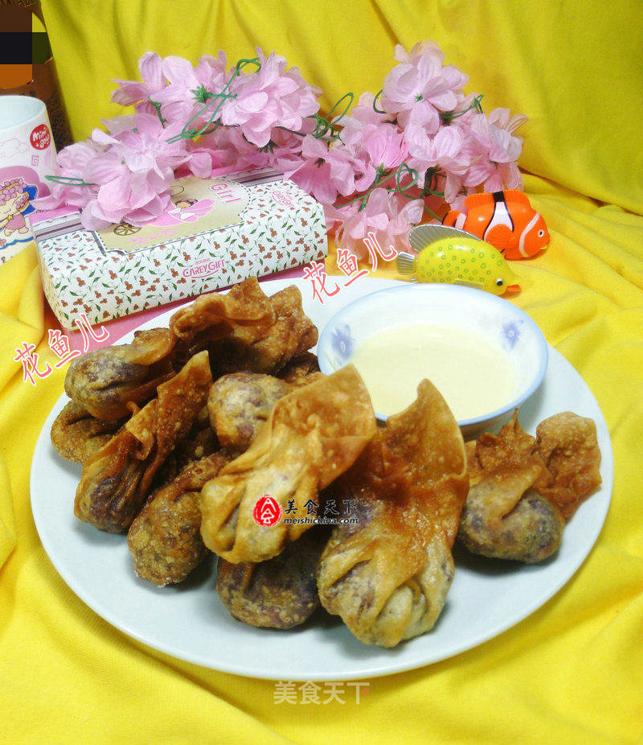

# 脆皮紫薯

## 📋 基本資訊 / Recipe Overview
- **料理名稱**：脆皮紫薯
- **原始標題**：脆皮紫薯
- **素食流派 / Diet**：奶素 Lacto-Vegetarian
- **料理分類 / Category**：家常蔬食 / 经典热菜
- **來源平台 / Source**：[美食天下 · 精華素食專區](https://home.meishichina.com/recipe-200062.html)

## 🌿 食材及佐料清單 / Ingredients
- 紫薯 310克 (主料)
- 馄饨皮 180克 (主料)
- 炼乳 适量 (辅料)

## 🍳 烹飪步驟 / Step-by-Step Cooking Steps
1. 食材：紫薯、馄饨皮、炼乳
2. 将紫薯洗净。
3. 放在案板上切开。
4. 随后，将切好的紫薯放入蒸锅中。
5. 盖上盖蒸熟。
6. 开盖，捞出。
7. 晾凉。
8. 接着，将晾凉好的紫薯去皮，用勺子碾碎。
9. 然后，取馄饨皮放上紫薯。
10. 包好。
11. 全部包好的紫薯。
12. 最后，下入油锅中，用中小火炸成金黄色，即成。
13. 出锅装盘。

---
*食譜歸檔時間：2026-08-20 · 來源：美食天下 (home.meishichina.com)*