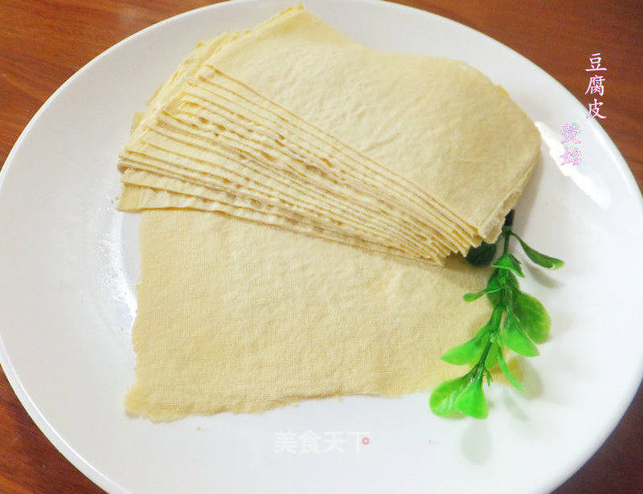

# 自制健康豆腐皮

## 📋 基本資訊 / Recipe Overview
- **料理名稱**：自制健康豆腐皮
- **原始標題**：自制健康豆腐皮
- **素食流派 / Diet**：全素 Vegan
- **料理分類 / Category**：家常蔬食 / 经典热菜
- **來源平台 / Source**：[美食天下 · 精華素食專區](https://home.meishichina.com/recipe-105450.html)

## 🌿 食材及佐料清單 / Ingredients
- 黄豆 250克 (主料)
- 水 2500ml (辅料)
- 酸浆 500ml (辅料)

## 🍳 烹飪步驟 / Step-by-Step Cooking Steps
1. 泡豆：将黄豆浸泡一夜，豆水重量比为1：3，泡好的黄豆约为原来的2倍，夏季6—8小时，春冬季12小时左右，如浸泡时间过长会影响出浆率
2. 磨浆：我用的飞利浦料理机，将泡软的黄豆加入2500克水（干豆和水的比例是1：10以内），为了提高出浆率，我都是磨两遍，
3. 滤渣：准备好功率豆浆的布袋，将打好的生豆浆倒在布袋中，用手把豆浆挤出，过滤后的豆浆放在锅内，纱布最好是密一点的那种，过滤不好煮浆时容易糊锅底，如果纱布不密，就要过滤两遍
4. 煮浆：过滤后的豆浆放在锅内煮开，将表面的泡沫捞出，豆浆煮开后还要继续小火煮五分钟左右，把浆煮透煮香，注意一定不要离开，要看着锅以防溢出
5. 过滤后的豆浆放在锅内煮开，将表面的泡沫捞出，豆浆煮开后还要继续小火煮五分钟左右，把浆煮透煮香，注意一定不要离开，要看着锅以防溢出
6. 点浆：酸浆500克兑水500克兑成酸卤。煮好的豆浆关火，降温到80度，加入450克左右冷水至锅中，加好后我都是测一下温度，刚好80度的，将兑好酸浆水分一勺的慢慢倒入锅中，此时用汤勺在锅中慢搅、轻搅。将分散的蛋白质团粒凝聚到一起。当豆浆开始出现絮状沉淀物并且与水分离就可以了，点好后要保温静止20分钟左右，豆腐皮点浆要嫩一点
7. 酸浆500克兑水500克兑成酸卤。煮好的豆浆关火，降温到80度，加入450克左右冷水至锅中，加好后我都是测一下温度，刚好80度的，将兑好酸浆水分一勺的慢慢倒入锅中，此时用汤勺在锅中慢搅、轻搅。将分散的蛋白质团粒凝聚到一起。当豆浆开始出现絮状沉淀物并且与水分离就可以了，点好后要保温静止20分钟左右，豆腐皮点浆要嫩一点
8. 模具：买的豆腐模具温水洗干净
9. 买的豆腐模具温水洗干净
10. 模具铺上豆腐布
11. 准备好一根长的布条，压豆腐皮用的
12. 豆浆已经凝固
13. 搅拌：用手抽把凝固一起的浆搅拌成小颗粒
14. 搅拌好是浆用勺子均匀的倒入模具，铺满，用勺子盛豆花进去，最好每次盛的一样多，这样做出来的豆腐皮就差不多一样厚
15. 铺满一层，把布条盖在上面，再把豆浆铺满第二层，把布条盖在上面，以此类推直到把豆花都用完，
16. 最后用最外面的布包好，
17. 盖上模子的盖子，自己掌握压制，总之越重越好，压制90分钟左右以后，打开盖子，就看到一张张豆腐皮了，要慢慢的揭啊，很薄的豆腐皮啊
18. 很薄的豆腐皮啊

---
*食譜歸檔時間：2026-08-20 · 來源：美食天下 (home.meishichina.com)*