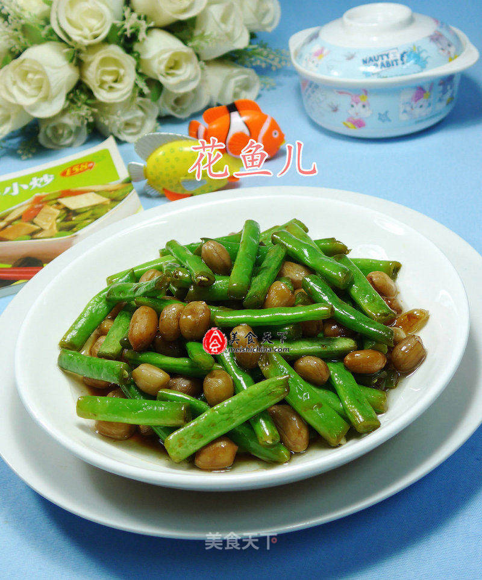

# 花生米炒梅豆

## 📋 基本資訊 / Recipe Overview
- **料理名稱**：花生米炒梅豆
- **原始標題**：花生米炒梅豆
- **素食流派 / Diet**：全素 Vegan
- **料理分類 / Category**：家常蔬食 / 经典热菜
- **來源平台 / Source**：[美食天下 · 精華素食專區](https://home.meishichina.com/recipe-230023.html)

## 🌿 食材及佐料清單 / Ingredients
- 梅豆 125克 (主料)
- 花生米 80克 (主料)
- 生抽 适量 (辅料)
- 盐 适量 (辅料)
- 味精 适量 (辅料)

## 🍳 烹飪步驟 / Step-by-Step Cooking Steps
1. 食材：梅豆、花生米（已煮熟）
2. 将梅豆摘洗一下，捞出。
3. 随后，将摘洗好的梅豆下入清水锅中焯开至熟，捞出。
4. 烧锅倒油烧热，下入焯好的梅豆翻炒一下。
5. 接着，合入已煮熟的花生米翻炒翻炒。
6. 然后，加适量的生抽。
7. 加适量的盐。
8. 加适量的味精。
9. 调味炒匀，即可。

---
*食譜歸檔時間：2026-08-20 · 來源：美食天下 (home.meishichina.com)*