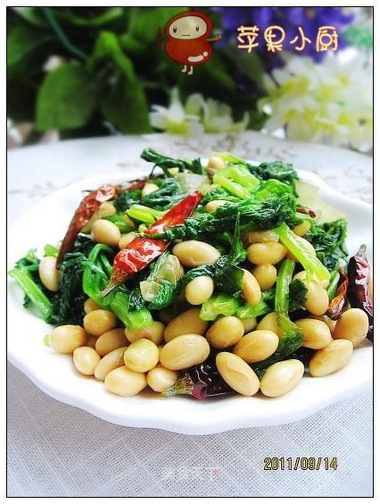

# 芹叶炒黄豆

## 📋 基本資訊 / Recipe Overview
- **料理名稱**：芹叶炒黄豆
- **原始標題**：芹叶炒黄豆
- **素食流派 / Diet**：全素 Vegan
- **料理分類 / Category**：家常蔬食 / 经典热菜
- **來源平台 / Source**：[美食天下 · 精華素食專區](https://home.meishichina.com/recipe-106428.html)

## 🌿 食材及佐料清單 / Ingredients
- 芹菜叶 适量 (主料)
- 五香黄豆 适量 (主料)
- 干红椒 适量 (辅料)
- 洋葱 适量 (辅料)
- 鸡精 适量 (配料)
- 盐 适量 (配料)

## 🍳 烹飪步驟 / Step-by-Step Cooking Steps
1. 准备芹菜叶、五香黄豆。
2. 芹叶洗净入沸水略焯。
3. 捞出过凉。
4. 捞出挤净水份，随意切上几刀。
5. 锅中放适量油，入干红椒爆香。
6. 加入洋葱粒炒香。
7. 加入芹叶翻炒，入盐调味。
8. 加入黄豆。
9. 炒匀后可加少许水略炒，至汤汁干，加鸡精调味出锅。

---
*食譜歸檔時間：2026-08-20 · 來源：美食天下 (home.meishichina.com)*