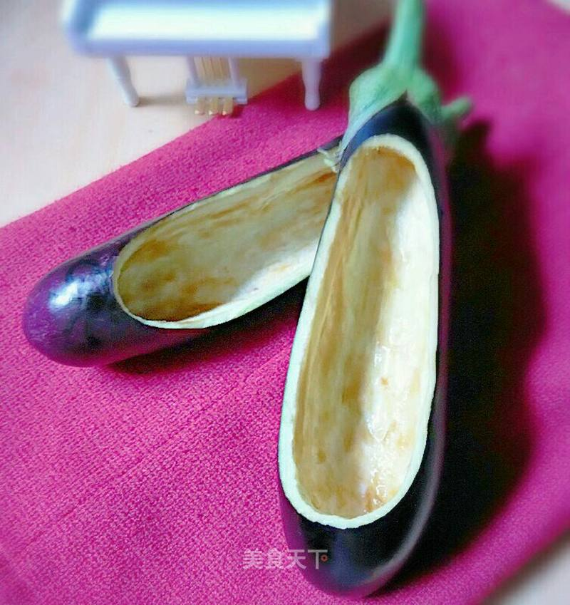

# 茄子绣花鞋

## 📋 基本資訊 / Recipe Overview
- **料理名稱**：茄子绣花鞋
- **原始標題**：茄子绣花鞋
- **素食流派 / Diet**：全素 Vegan
- **料理分類 / Category**：家常蔬食 / 经典热菜
- **來源平台 / Source**：[美食天下 · 精華素食專區](https://home.meishichina.com/recipe-222482.html)

## 🌿 食材及佐料清單 / Ingredients
- 茄子 2个 (主料)
- 小刀子 1个 (辅料)
- 勺子 1个 (辅料)

## 🍳 烹飪步驟 / Step-by-Step Cooking Steps
1. 茄子准备好了！
2. 然后用刀子背部刻出一个大体的印子，然后顺着印子用刀子慢慢抠出多余的茄子心，然后在用勺子处理平滑就可以了！
3. 成品欣赏！

---
*食譜歸檔時間：2026-08-20 · 來源：美食天下 (home.meishichina.com)*