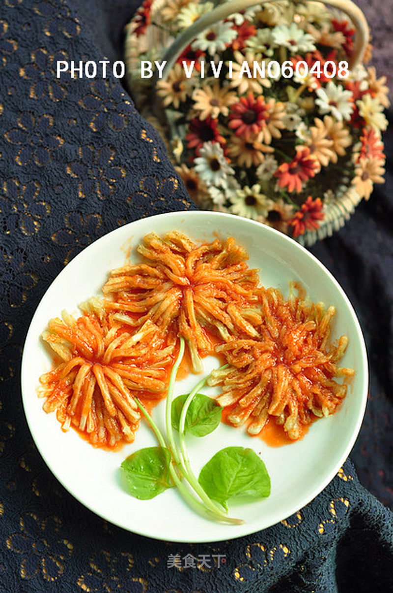

# 菊花茄子

## 📋 基本資訊 / Recipe Overview
- **料理名稱**：菊花茄子
- **原始標題**：菊花茄子
- **素食流派 / Diet**：全素 Vegan
- **料理分類 / Category**：面食主食
- **來源平台 / Source**：[美食天下 · 精華素食專區](https://home.meishichina.com/recipe-71208.html)

## 🌿 食材及佐料清單 / Ingredients
- 茄子 适量 (主料)
- 番茄酱 适量 (辅料)
- 面粉 适量 (辅料)
- 油 适量 (辅料)
- 盐 适量 (配料)
- 白糖 适量 (配料)

## 🍳 烹飪步驟 / Step-by-Step Cooking Steps
1. 主料备用。
2. 把茄子去皮。
3. 切成长度相同的段。
4. 在墩的横断面剞上十字花刀。
5. 撒少量盐略腌。
6. 茄花放入面粉的盘子中，沾匀面粉。
7. 油锅烧热，放入茄花。
8. 炸好的茄花，小心的用筷子夹入盘中。
9. 炸好的茄花摆盘。
10. 放油，放番茄酱炒，再入白糖，盐。
11. 淋在炸好的茄花眼即可。

---
*食譜歸檔時間：2026-08-20 · 來源：美食天下 (home.meishichina.com)*