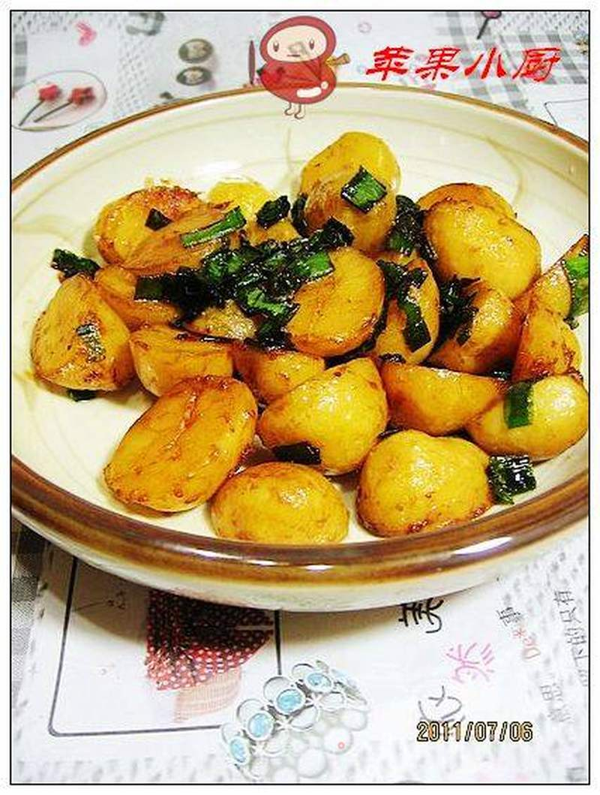

# 葱油小土豆

## 📋 基本資訊 / Recipe Overview
- **料理名稱**：葱油小土豆
- **原始標題**：葱油小土豆
- **素食流派 / Diet**：全素 Vegan
- **料理分類 / Category**：养生汤品
- **來源平台 / Source**：[美食天下 · 精華素食專區](https://home.meishichina.com/recipe-107428.html)

## 🌿 食材及佐料清單 / Ingredients
- 熟小土豆 适量 (主料)
- 葱 适量 (辅料)
- 盐 适量 (配料)
- 酱油 适量 (配料)
- 高汤精 适量 (配料)

## 🍳 烹飪步驟 / Step-by-Step Cooking Steps
1. 煮熟的小土豆去皮
2. 对切成两半。
3. 香葱叶切成细段。
4. 锅中放适量油，加入二分之一葱叶炒香。
5. 加入小土豆翻炒。
6. 加入适量盐，酱油。
7. 加入剩余的葱叶，和少许高汤精调味出锅。

---
*食譜歸檔時間：2026-08-20 · 來源：美食天下 (home.meishichina.com)*