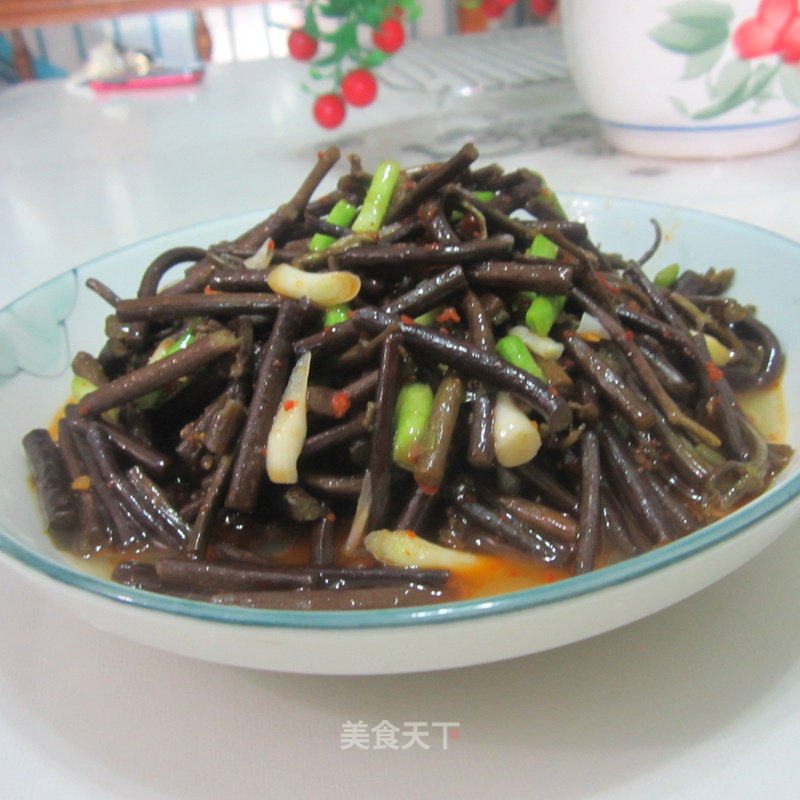

# 蒜白山里蕨菜

## 📋 基本資訊 / Recipe Overview
- **料理名稱**：蒜白山里蕨菜
- **原始標題**：蒜白山里蕨菜
- **素食流派 / Diet**：全素 Vegan
- **料理分類 / Category**：家常蔬食 / 经典热菜
- **來源平台 / Source**：[美食天下 · 精華素食專區](https://home.meishichina.com/recipe-201455.html)

## 🌿 食材及佐料清單 / Ingredients
- 蕨菜 适量 (主料)
- 盐 适量 (辅料)
- 猪油 适量 (辅料)
- 味精 适量 (辅料)
- 辣椒汁 适量 (辅料)

## 🍳 烹飪步驟 / Step-by-Step Cooking Steps
1. 好的蕨菜泡去涩味，
2. 大蒜少许切段。
3. 烧油，放进蕨菜放点盐炒匀，
4. 翻炒片刻，
5. 放进辣椒汁提辣。
6. 炒匀，
7. 放点清水将蕨菜煮软煮入味，
8. 放进大蒜炒匀，
9. 出锅时放点味精即可。
10. 装盘上桌。

---
*食譜歸檔時間：2026-08-20 · 來源：美食天下 (home.meishichina.com)*