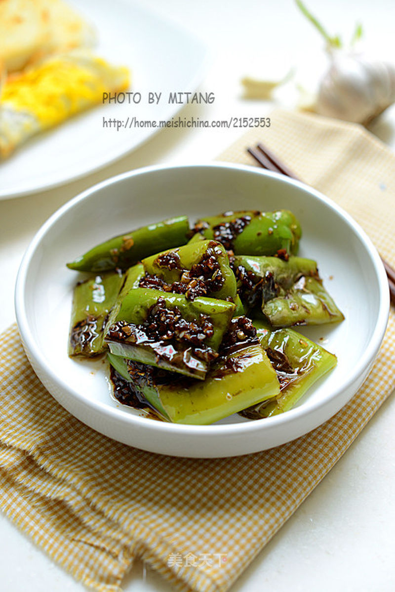

# 虎皮尖椒

## 📋 基本資訊 / Recipe Overview
- **料理名稱**：虎皮尖椒
- **原始標題**：虎皮尖椒
- **素食流派 / Diet**：全素 Vegan
- **料理分類 / Category**：家常蔬食 / 经典热菜
- **來源平台 / Source**：[美食天下 · 精華素食專區](https://home.meishichina.com/recipe-113938.html)

## 🌿 食材及佐料清單 / Ingredients
- 尖椒 适量 (主料)
- 大蒜 适量 (辅料)
- 蚝油 适量 (配料)
- 盐 适量 (配料)
- 鸡精 适量 (配料)
- 糖 适量 (配料)
- 香醋 适量 (配料)
- 花生油 适量 (配料)

## 🍳 烹飪步驟 / Step-by-Step Cooking Steps
1. 准备材料
2. 尖椒洗净，去蒂和筋籽，切段。大蒜切末
3. 取蚝油，用清水澥开，加入适量盐、少许糖、香醋、鸡精调成酱汁
4. 锅中不要放油，将尖椒段干煸
5. 直至绿尖椒表皮起泡微微变焦后盛出
6. 锅中放油，下蒜末爆香
7. 放入煸好的尖椒翻炒
8. 加入酱汁调味
9. 翻炒均匀，关火装盘即可

---
*食譜歸檔時間：2026-08-20 · 來源：美食天下 (home.meishichina.com)*