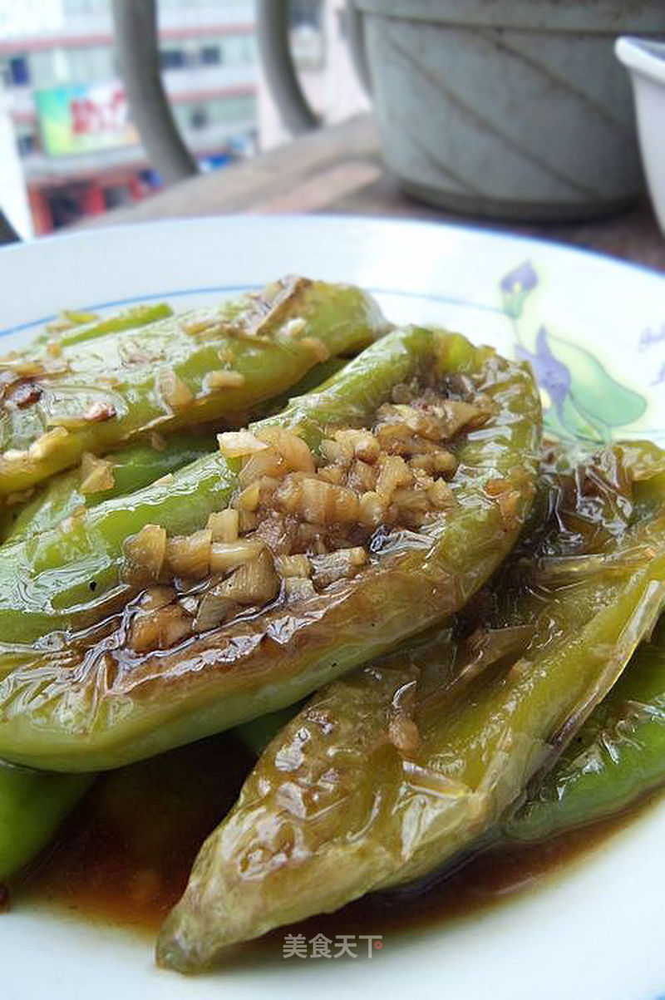

# 虎皮青椒

## 📋 基本資訊 / Recipe Overview
- **料理名稱**：虎皮青椒
- **原始標題**：虎皮青椒
- **素食流派 / Diet**：全素 Vegan
- **料理分類 / Category**：家常蔬食 / 经典热菜
- **來源平台 / Source**：[美食天下 · 精華素食專區](https://home.meishichina.com/recipe-61178.html)

## 🌿 食材及佐料清單 / Ingredients
- 青椒 200g (主料)
- 油 适量 (辅料)
- 蒜 适量 (辅料)
- 生抽 适量 (辅料)
- 醋 适量 (辅料)
- 盐 适量 (辅料)
- 糖 适量 (辅料)

## 🍳 烹飪步驟 / Step-by-Step Cooking Steps
1. 原料图，青椒洗净、蒜去皮备用。
2. 将青椒的籽去掉，蒜切末。
3. 把生抽、醋、糖、盐加水调成料汁。
4. 起油锅。
5. 下青椒小火煸炒，用锅铲按压划圈。
6. 炒至两面起虎皮纹，盛出备用。
7. 重新下油，小火爆香蒜末，下调好的料汁。
8. 加水烧开。
9. 下煸好的青椒。
10. 炒匀后大火略为收汁即可。

---
*食譜歸檔時間：2026-08-20 · 來源：美食天下 (home.meishichina.com)*