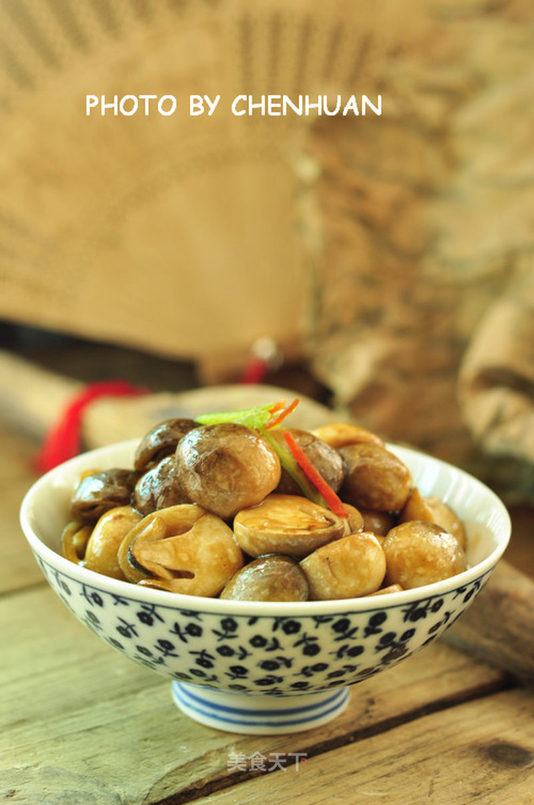

# 蚝油草菇

## 📋 基本資訊 / Recipe Overview
- **料理名稱**：蚝油草菇
- **原始標題**：蚝油草菇
- **素食流派 / Diet**：全素 Vegan
- **料理分類 / Category**：家常蔬食 / 经典热菜
- **來源平台 / Source**：[美食天下 · 精華素食專區](https://home.meishichina.com/recipe-95798.html)

## 🌿 食材及佐料清單 / Ingredients
- 草菇 适量 (主料)
- 油 适量 (辅料)
- 青红椒丝 适量 (辅料)
- 葱白丝 适量 (辅料)
- 蚝油 适量 (配料)

## 🍳 烹飪步驟 / Step-by-Step Cooking Steps
1. 草菇备用。
2. 青红辣椒、葱白丝，蚝油备用。
3. 草菇去根，洗净，从中间切开。
4. 锅里放入少许食用油，烧热。
5. 放入草菇大火爆炒均匀。
6. 倒入一点五汤匙蚝油。
7. 大火炒到蚝油均匀裹在草菇上。
8. 装盘用青红辣椒丝，葱白丝装饰即可。

---
*食譜歸檔時間：2026-08-20 · 來源：美食天下 (home.meishichina.com)*