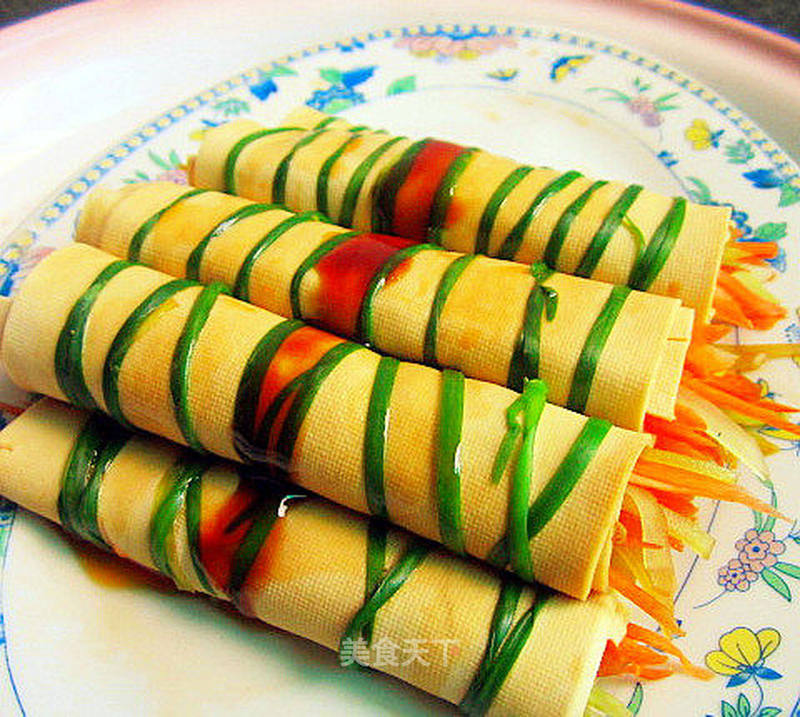

# 蚝油豆皮卷

## 📋 基本資訊 / Recipe Overview
- **料理名稱**：蚝油豆皮卷
- **原始標題**：蚝油豆皮卷
- **素食流派 / Diet**：全素 Vegan
- **料理分類 / Category**：面点小吃
- **來源平台 / Source**：[美食天下 · 精華素食專區](https://home.meishichina.com/recipe-106153.html)

## 🌿 食材及佐料清單 / Ingredients
- 豆腐皮 适量 (主料)
- 胡萝卜丝 适量 (辅料)
- 莴笋丝 适量 (辅料)
- 精盐 适量 (配料)
- 辣油 适量 (配料)
- 蚝油 适量 (配料)
- 蒸鱼豉油 适量 (配料)
- 生抽 适量 (配料)

## 🍳 烹飪步驟 / Step-by-Step Cooking Steps
1. 备好食材。
2. 将莴笋、胡萝卜切丝。
3. 加入精盐、生抽腌入味。
4. 豆腐皮加适量的盐入味。取豆腐皮平铺，码上莴笋丝，胡萝卜丝。
5. 再卷成卷，如图。
6. 卷好的豆皮卷用焯软的韭菜扎好，如图。
7. 做好的豆皮卷放进微波炉里高火5分钟。
8. 再淋上蒸鱼豉油。
9. 淋上辣椒油，蚝油。
10. 蚝油豆皮卷即成。

---
*食譜歸檔時間：2026-08-20 · 來源：美食天下 (home.meishichina.com)*