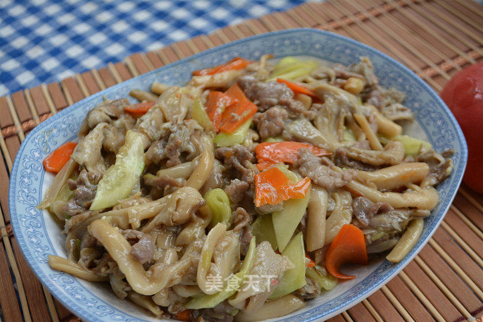

# 蚝油鲜平菇

## 📋 基本資訊 / Recipe Overview
- **料理名稱**：蚝油鲜平菇
- **原始標題**：蚝油鲜平菇
- **素食流派 / Diet**：全素 Vegan
- **料理分類 / Category**：家常蔬食 / 经典热菜
- **來源平台 / Source**：[美食天下 · 精華素食專區](https://home.meishichina.com/recipe-229719.html)

## 🌿 食材及佐料清單 / Ingredients
- 鲜平菇 400g (主料)
- 胡萝卜 50g (主料)
- 黄瓜 50g (主料)
- 瘦肉丝 50g (主料)
- 食用油 80g (辅料)
- 葱丝 10g (辅料)
- 食盐 5g (辅料)
- 蚝油 15g (辅料)
- 鸡精 3g (辅料)

## 🍳 烹飪步驟 / Step-by-Step Cooking Steps
1. 鲜平菇洗净用淡盐水浸泡十分钟。
2. 胡萝卜切菱形片，用开水焯烫一分钟捞出，过凉备用，黄瓜切片。
3. 坐锅倒入食用油，待油温四成热下入葱花、瘦肉丝煸炒片刻即下入胡萝卜片、平菇，黄瓜片，淋入耗油、食盐、鸡精继续翻炒几下即可出锅装盘。
4. 装盘后滴几滴香油。

---
*食譜歸檔時間：2026-08-20 · 來源：美食天下 (home.meishichina.com)*