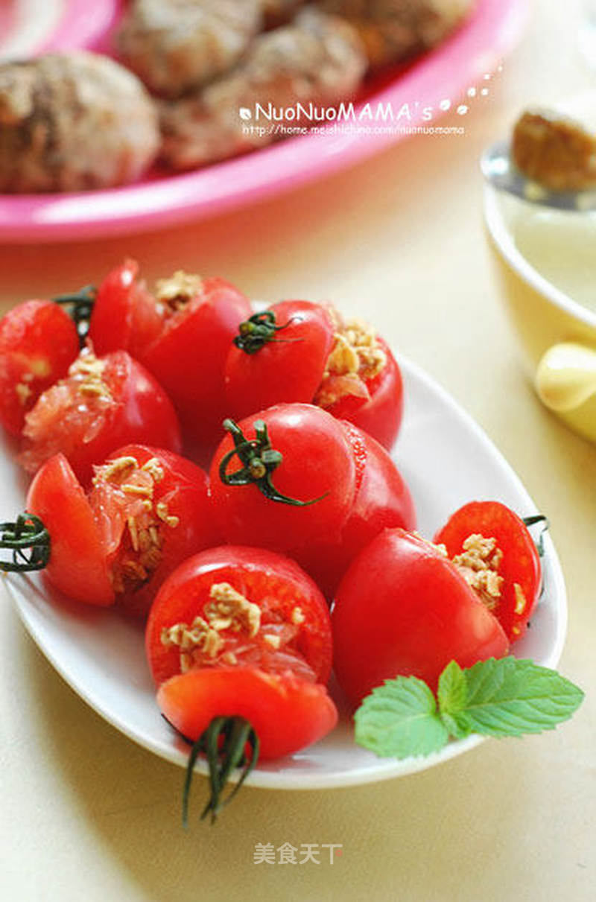

# 西柚燕麦番茄盏

## 📋 基本資訊 / Recipe Overview
- **料理名稱**：西柚燕麦番茄盏
- **原始標題**：西柚燕麦番茄盏
- **素食流派 / Diet**：全素 Vegan
- **料理分類 / Category**：家常蔬食 / 经典热菜
- **來源平台 / Source**：[美食天下 · 精華素食專區](https://home.meishichina.com/recipe-90578.html)

## 🌿 食材及佐料清單 / Ingredients
- 水果燕麦片 适量 (主料)
- 西柚 1个 (主料)
- 樱桃番茄 随意 (主料)

## 🍳 烹飪步驟 / Step-by-Step Cooking Steps
1. 材料准备；
2. 把番茄从头上切开不要切断连着点皮；
3. 用小勺挖出籽和果肉，番茄盏备用；
4. 西柚切半剥开；
5. 用小勺剔出果肉；
6. 将果肉打碎备用；
7. 加入水果燕麦片稍加拌匀（如果怕酸的还可以加点砂糖）；
8. 酿入番茄盏中；
9. 装盘即可。

---
*食譜歸檔時間：2026-08-20 · 來源：美食天下 (home.meishichina.com)*