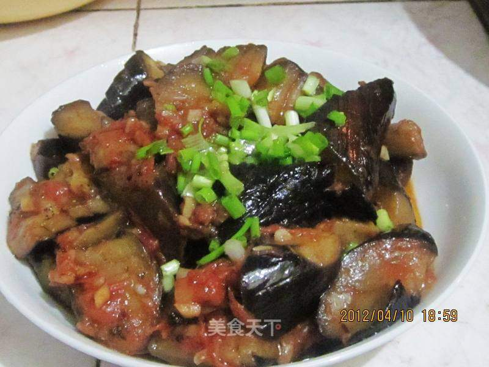

# 西红柿炒茄子

## 📋 基本資訊 / Recipe Overview
- **料理名稱**：西红柿炒茄子
- **原始標題**：西红柿炒茄子
- **素食流派 / Diet**：全素 Vegan
- **料理分類 / Category**：家常蔬食 / 经典热菜
- **來源平台 / Source**：[美食天下 · 精華素食專區](https://home.meishichina.com/recipe-58958.html)

## 🌿 食材及佐料清單 / Ingredients
- 西红柿 2个 (主料)
- 茄子 3个 (主料)
- 葱 少许 (辅料)
- 姜 少许 (辅料)
- 蒜 少许 (辅料)
- 花椒 少许 (辅料)
- 盐 适量 (配料)
- 糖 适量 (配料)

## 🍳 烹飪步驟 / Step-by-Step Cooking Steps
1. 准备好以上食材。
2. 茄子切块后在上面划上几刀，以便于入味。
3. 西红柿切小丁。
4. 葱姜蒜切末。
5. 锅内加油烧热，放入发椒爆香。
6. 倒入茄子翻炒到变软后盛出。
7. 锅内留油，放入葱姜蒜爆香，倒入西红柿炒至出红油。
8. 再倒入茄子一起炒至茄子上都裹上西红柿酱，洒上葱花出锅。

---
*食譜歸檔時間：2026-08-20 · 來源：美食天下 (home.meishichina.com)*