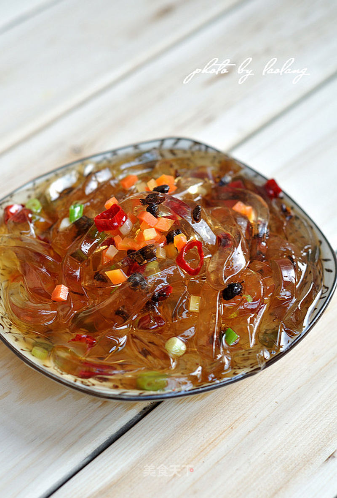

# 豉香海藻凉粉

## 📋 基本資訊 / Recipe Overview
- **料理名稱**：豉香海藻凉粉
- **原始標題**：豉香海藻凉粉
- **素食流派 / Diet**：全素 Vegan
- **料理分類 / Category**：面食主食
- **來源平台 / Source**：[美食天下 · 精華素食專區](https://home.meishichina.com/recipe-92988.html)

## 🌿 食材及佐料清單 / Ingredients
- 海藻凉粉 适量 (主料)
- 豆豉 适量 (辅料)
- 干红椒 适量 (配料)
- 花椒 适量 (配料)
- 油 适量 (配料)
- 胡萝卜咸菜 适量 (配料)
- 香醋 适量 (配料)
- 精盐 适量 (配料)

## 🍳 烹飪步驟 / Step-by-Step Cooking Steps
1. 沿海藻凉粉包装上的切割提示把海藻凉粉切开。
2. 倒出海藻凉粉。
3. 把凉粉切成粗条。
4. 把凉粉条盛入干净的容器里，倒入一汤匙香醋、少许精盐。
5. 锅里倒少许油，放入几粒豆豉炸酥、炸香。
6. 把炸好的豆豉切碎，撒到凉粉上。
7. 胡萝卜咸菜切小粒。
8. 红辣椒去籽，切碎。
9. 小葱洗净切碎。
10. 锅里油热后放入花椒爆香，捞出花椒不用。
11. 放入红辣椒碎，小葱末爆香。
12. 把料油倒在凉粉上，拌匀即可。

---
*食譜歸檔時間：2026-08-20 · 來源：美食天下 (home.meishichina.com)*