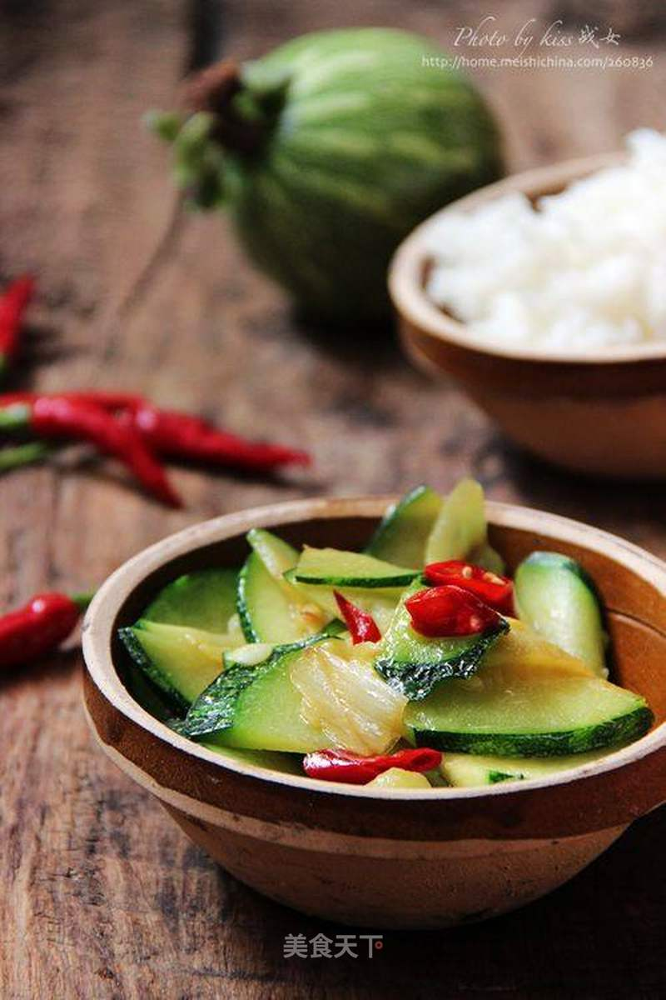

# 辣炒倭瓜片

## 📋 基本資訊 / Recipe Overview
- **料理名稱**：辣炒倭瓜片
- **原始標題**：辣炒倭瓜片
- **素食流派 / Diet**：全素 Vegan
- **料理分類 / Category**：家常蔬食 / 经典热菜
- **來源平台 / Source**：[美食天下 · 精華素食專區](https://home.meishichina.com/recipe-94528.html)

## 🌿 食材及佐料清單 / Ingredients
- 倭瓜 适量 (主料)
- 红辣椒 适量 (辅料)
- 大葱 适量 (辅料)
- 猪油 适量 (辅料)
- 盐 适量 (配料)
- 六月鲜酱油 适量 (配料)

## 🍳 烹飪步驟 / Step-by-Step Cooking Steps
1. 嫩倭瓜洗净，切片；红辣椒切小段、葱切片。
2. 锅置火上适量猪油烧热，下入红辣椒、葱片爆香。
3. 倒入倭瓜片快速翻炒。
4. 待瓜片略呈透明状，调入酱油1勺、少许盐炒匀。
5. 关火，盛入盘中即可上桌享用。

---
*食譜歸檔時間：2026-08-20 · 來源：美食天下 (home.meishichina.com)*