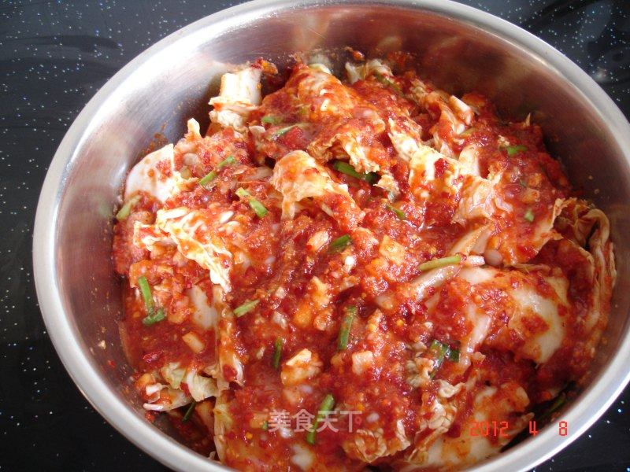

# 辣白菜

## 📋 基本資訊 / Recipe Overview
- **料理名稱**：辣白菜
- **原始標題**：辣白菜
- **素食流派 / Diet**：全素 Vegan
- **料理分類 / Category**：面食主食
- **來源平台 / Source**：[美食天下 · 精華素食專區](https://home.meishichina.com/recipe-58198.html)

## 🌿 食材及佐料清單 / Ingredients
- 白菜 一棵 (主料)
- 韭菜 适量 (辅料)
- 江米面 适量 (辅料)
- 辣椒面 三两 (配料)
- 鱼露 30毫升 (配料)
- 蒜 五两 (配料)
- 姜 二两 (配料)
- 梨 一个 (配料)
- 盐 适量 (配料)

## 🍳 烹飪步驟 / Step-by-Step Cooking Steps
1. 白菜洗净掰成小块，用盐腌一晚上，第二天冲洗盐份，控干水。
2. 江米面加少许水懈开，炒锅加水烧开，倒入江米糊搅均放凉。
3. 辣椒面用少许开水冲泡放凉。
4. 蒜，姜，梨切碎，放入搅拌器中搅碎。
5. 辣椒糊中放入搅碎的蒜，姜，梨，鱼露，韭菜，少许盐和江米糊。
6. 搅拌好的糊。
7. 把控干水份的白菜放入盆中，加入辣椒糊拌均，放置2-3天进行发酵，最后放入保鲜盒中，放入冰箱冷藏即可。

---
*食譜歸檔時間：2026-08-20 · 來源：美食天下 (home.meishichina.com)*