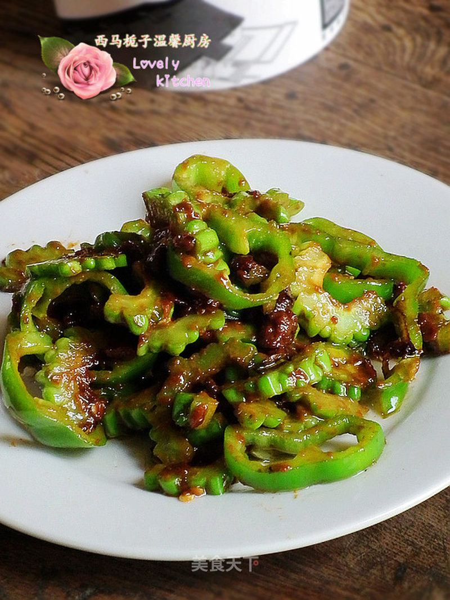

# 酱爆苦瓜尖椒

## 📋 基本資訊 / Recipe Overview
- **料理名稱**：酱爆苦瓜尖椒
- **原始標題**：酱爆苦瓜尖椒
- **素食流派 / Diet**：全素 Vegan
- **料理分類 / Category**：家常蔬食 / 经典热菜
- **來源平台 / Source**：[美食天下 · 精華素食專區](https://home.meishichina.com/recipe-103618.html)

## 🌿 食材及佐料清單 / Ingredients
- 尖椒 100克， (主料)
- 苦瓜 200克 (主料)
- 豆瓣酱 适量 (辅料)
- 鸡精 适量 (辅料)
- 葱碎 适量 (辅料)

## 🍳 烹飪步驟 / Step-by-Step Cooking Steps
1. 准备好食材。
2. 苦瓜洗净去掉瓤，切成片。
3. 尖椒洗净切成片。
4. 锅中注水，烧开，下入苦瓜片焯水。
5. 焯水的苦瓜直接放入冰水。冲凉后沥干水分。
6. 另起锅，放入油，下入葱碎爆香。
7. 加入一大勺豆瓣酱煸炒。
8. 煸炒均匀。
9. 倒入焯水的苦瓜和尖椒片
10. 翻炒均匀，加入鸡精调味即可。

---
*食譜歸檔時間：2026-08-20 · 來源：美食天下 (home.meishichina.com)*