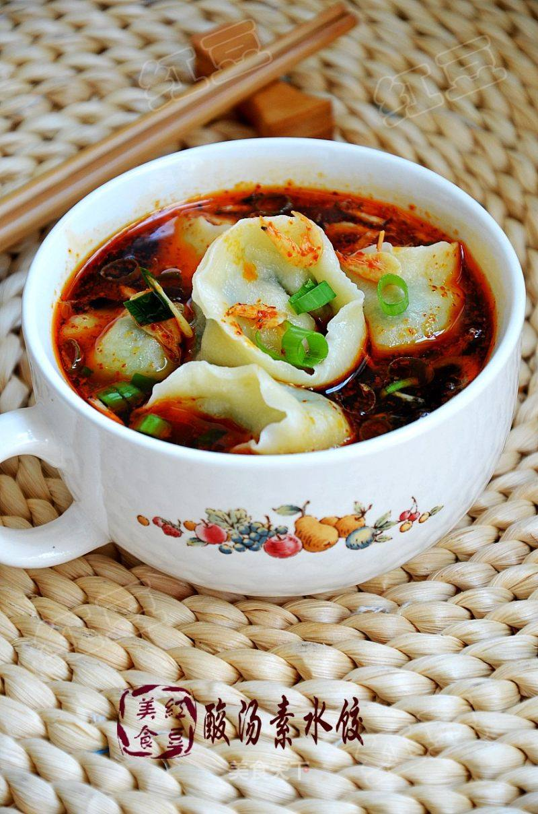

# 酸汤素水饺

## 📋 基本資訊 / Recipe Overview
- **料理名稱**：酸汤素水饺
- **原始標題**：酸汤素水饺
- **素食流派 / Diet**：蛋素 Ovo-Vegetarian
- **料理分類 / Category**：面食主食
- **來源平台 / Source**：[美食天下 · 精華素食專區](https://home.meishichina.com/recipe-96578.html)

## 🌿 食材及佐料清單 / Ingredients
- 面粉 250克 (主料)
- 韭菜 300克 (辅料)
- 鸡蛋 4个 (辅料)
- 盐 适量 (配料)
- 胡椒粉 2克 (配料)
- 五香粉 3克 (配料)
- 糖 2克 (配料)
- 鸡精 少许 (配料)
- 香油 适量 (配料)
- 酱油 适量 (配料)
- 香醋 适量 (配料)
- 虾皮 适量 (配料)
- 紫菜 适量 (配料)
- 葱花 适量 (配料)
- 油辣椒 适量 (配料)

## 🍳 烹飪步驟 / Step-by-Step Cooking Steps
1. 面粉用冷水和成面团静置备用。
2. 韭菜洗净切碎。
3. 鸡蛋炒熟切碎和韭菜一起加入调味料拌均匀。
4. 面团揉均匀搓条切小剂子，擀成圆皮。
5. 包入馅料边缘封口捏紧。
6. 然后翻转对折捏紧，成为元宝饺子生坯。
7. 依次全部做好。
8. 取一个小碗，加入5毫升生抽，10毫升香醋，3克油辣子，盐，鸡精，葱花，虾皮，紫菜，香油各少许，
9. 饺子入锅煮熟。
10. 把饺子连汤一起盛入碗中，即可食用。

---
*食譜歸檔時間：2026-08-20 · 來源：美食天下 (home.meishichina.com)*