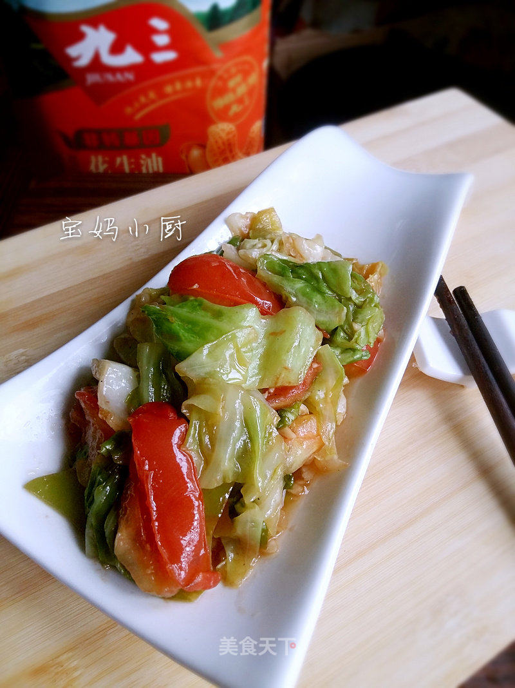

# 酸辣菜

## 📋 基本資訊 / Recipe Overview
- **料理名稱**：酸辣菜
- **原始標題**：酸辣菜
- **素食流派 / Diet**：全素 Vegan
- **料理分類 / Category**：面食主食
- **來源平台 / Source**：[美食天下 · 精華素食專區](https://home.meishichina.com/recipe-232626.html)

## 🌿 食材及佐料清單 / Ingredients
- 圆白菜 少半个 (主料)
- 辣椒 1个 (主料)
- 西红柿 2个 (主料)
- 九三非转基因花生油 适量 (辅料)
- 葱花 少许 (辅料)
- 蒜末 少许 (辅料)
- 鸡粉 少许 (辅料)

## 🍳 烹飪步驟 / Step-by-Step Cooking Steps
1. 圆白菜切三角块
2. 泡水洗净，控水备用
3. 辣椒、西红柿切块
4. 锅内入九三花生油，下入葱花爆香
5. 放入圆白菜大火翻炒
6. 放入西红柿和辣椒翻炒，放入盐
7. 西红柿微软时加入蒜末翻炒几下
8. 加入鸡粉翻炒出锅，酸辣开胃，超级下饭！
9. 成品图！
10. 成品图！！
11. 成品图！！！

---
*食譜歸檔時間：2026-08-20 · 來源：美食天下 (home.meishichina.com)*