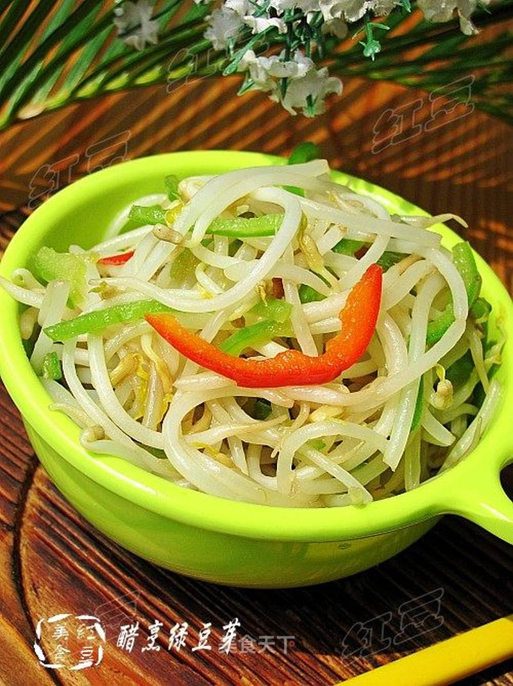

# 醋烹绿豆芽

## 📋 基本資訊 / Recipe Overview
- **料理名稱**：醋烹绿豆芽
- **原始標題**：醋烹绿豆芽
- **素食流派 / Diet**：全素 Vegan
- **料理分類 / Category**：家常蔬食 / 经典热菜
- **來源平台 / Source**：[美食天下 · 精華素食專區](https://home.meishichina.com/recipe-34244.html)

## 🌿 食材及佐料清單 / Ingredients
- 绿豆芽 400克 (主料)
- 青椒 一个 (辅料)
- 红椒 少许 (辅料)
- 葱 适量 (配料)
- 姜 适量 (配料)
- 盐 适量 (配料)
- 糖 2克 (配料)
- 香醋 3克 (配料)
- 鸡精 适量 (配料)
- 香油 适量 (配料)

## 🍳 烹飪步驟 / Step-by-Step Cooking Steps
1. 炒锅到油烧热爆香葱姜。
2. 倒入洗净的绿豆芽翻炒。
3. 加入盐，和糖翻炒均匀。
4. 再把青椒丝和红椒倒入翻炒。
5. 烹入香醋翻炒均匀。
6. 最后加入鸡精，香油炒均匀关火。

---
*食譜歸檔時間：2026-08-20 · 來源：美食天下 (home.meishichina.com)*