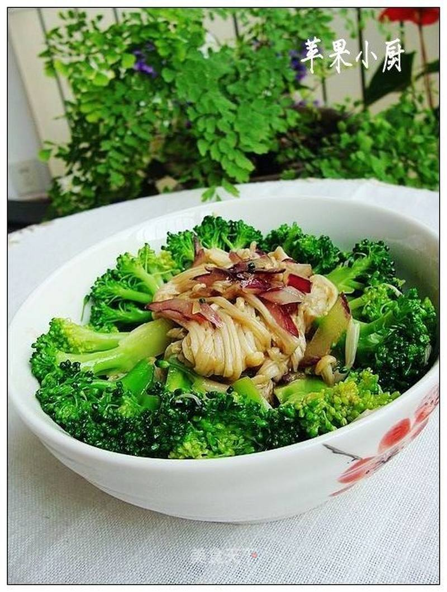

# 金针西兰花

## 📋 基本資訊 / Recipe Overview
- **料理名稱**：金针西兰花
- **原始標題**：金针西兰花
- **素食流派 / Diet**：全素 Vegan
- **料理分類 / Category**：养生汤品
- **來源平台 / Source**：[美食天下 · 精華素食專區](https://home.meishichina.com/recipe-106268.html)

## 🌿 食材及佐料清單 / Ingredients
- 金针菇 适量 (主料)
- 西兰花 适量 (主料)
- 洋葱 适量 (辅料)
- 醋 适量 (配料)
- 芝麻油 适量 (配料)
- 盐 适量 (配料)
- 高汤精 适量 (配料)
- 鲜鸡汁 适量 (配料)

## 🍳 烹飪步驟 / Step-by-Step Cooking Steps
1. 金针菇去根洗净撕开。
2. 西兰花切成小朵。
3. 锅中加高汤精、少许盐烧沸。
4. 入西兰花焯烫捞出。
5. 入金针菇焯软捞出。
6. 过凉后挤净水份。
7. 加入醋。
8. 加入少许鲜鸡汁。
9. 加入芝麻油。
10. 锅中放少许油，入洋葱丁炒香，至洋葱发黄。
11. 将炸好的洋葱油倒入盆中，加盐拌匀装盘。

---
*食譜歸檔時間：2026-08-20 · 來源：美食天下 (home.meishichina.com)*