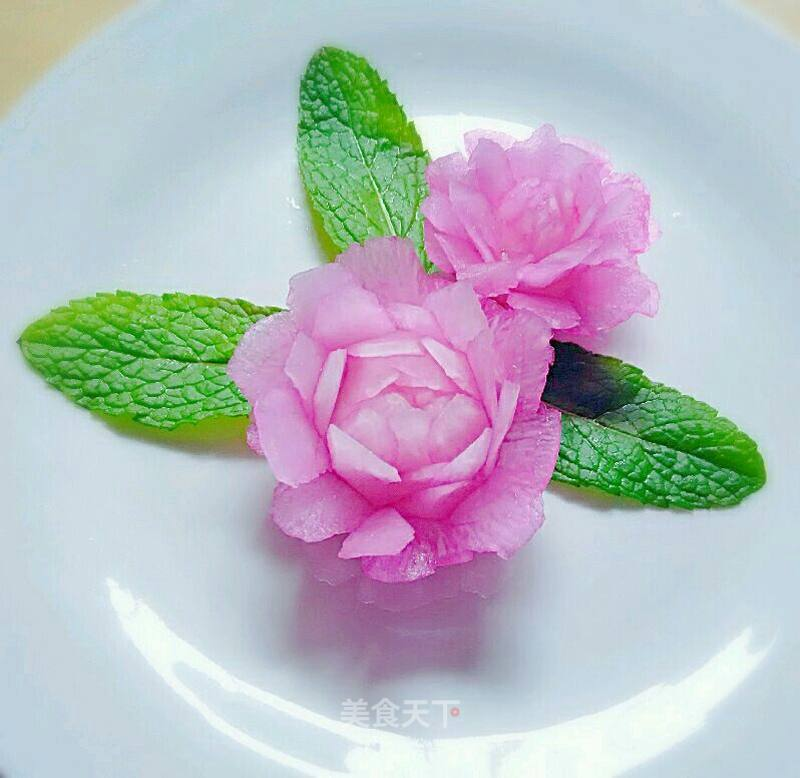

# 雕刻白萝卜花

## 📋 基本資訊 / Recipe Overview
- **料理名稱**：雕刻白萝卜花
- **原始標題**：雕刻白萝卜花
- **素食流派 / Diet**：全素 Vegan
- **料理分類 / Category**：家常蔬食 / 经典热菜
- **來源平台 / Source**：[美食天下 · 精華素食專區](https://home.meishichina.com/recipe-222489.html)

## 🌿 食材及佐料清單 / Ingredients
- 白萝卜 2段 (主料)
- 美工刀 1个 (辅料)
- 食用色素 适量 (辅料)
- 水 适量 (辅料)

## 🍳 烹飪步驟 / Step-by-Step Cooking Steps
1. 今天做的白萝卜花，但是照片没有拍摄，我用的是上次雕刻拍摄的照片，亲爱的们不好意思，大同小异！首先准备萝卜一段！
2. 第二层的花瓣要在下一层花瓣的中间，岔开！
3. 之后把多出来的边角用美工刀切掉，并且要是上小下大的形状！
4. 始终保持上一层的花瓣和下一层的岔开！要薄薄的！
5. 如图，刻一层就要把多余的边角去除掉！
6. 每刻一层都要保持萝卜是圆形，就是要去除多余的边角！如图！
7. 一层一层的雕刻好，可以换成白萝卜，今天做的白萝卜我没有拍照片，直接用上次做的照片了！
8. 可以把刻好的白萝卜泡到红色素水里面，泡五分钟就可以了！
9. 成品欣赏！

---
*食譜歸檔時間：2026-08-20 · 來源：美食天下 (home.meishichina.com)*