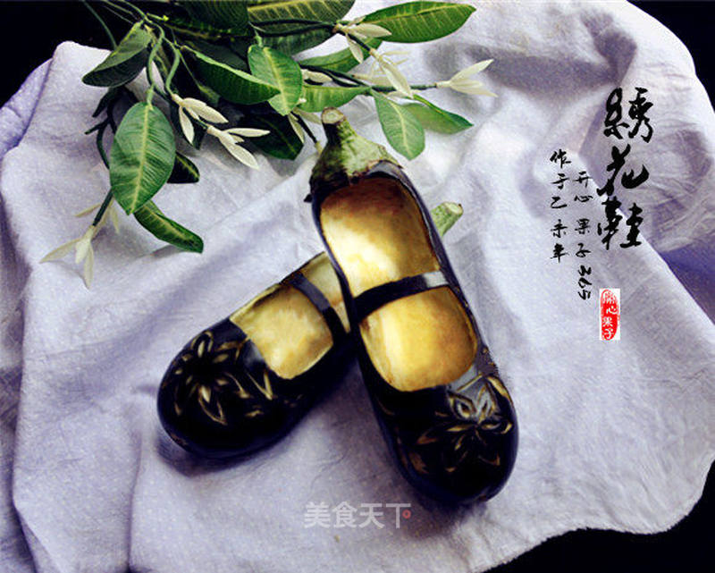

# 雕刻茄子绣花鞋忆童年

## 📋 基本資訊 / Recipe Overview
- **料理名稱**：雕刻茄子绣花鞋忆童年
- **原始標題**：雕刻茄子绣花鞋忆童年
- **素食流派 / Diet**：全素 Vegan
- **料理分類 / Category**：家常蔬食 / 经典热菜
- **來源平台 / Source**：[美食天下 · 精華素食專區](https://home.meishichina.com/recipe-222940.html)

## 🌿 食材及佐料清單 / Ingredients
- 茄子 2个 (主料)
- 挖球器 一把 (辅料)
- 美工刀 一把 (辅料)

## 🍳 烹飪步驟 / Step-by-Step Cooking Steps
1. 选择两个形状差不多，大小也差不多的紫茄子，最好是茄子形状稍微短而不粗不细的茄子，当然青茄子也是可以的，不过青茄子短而胖，估计刻出来的会很像小猪蹄绣花鞋了，哈哈！
2. 先用指甲轻轻的在茄子上划出鞋子的脚面口，然后用美工刀沿着指甲画好的线划好，并把上面一层茄子的紫皮表面削下来，记住现在先不能深挖鞋洞，因为茄子的肉去皮氧化比较快，为了能拍摄，所以鞋洞留到最后快完工的时候再挖
3. 雕刻鞋头部的装饰图案，一般图案可以雕刻一些小花、虎、龙、凤、牡丹等等。在过去鞋上的图案一般是有寓意的。当然那些对于我们来说难度太大了，你就雕刻一些简单的花卉吧！
4. 把另一只鞋子也给这样做好
5. 把两只雕有漂亮图案的绣花鞋进行挖鞋洞程序准备收工。挖鞋洞可以先用美工刀沿着鞋面口向下划深一点，然后再从中间30度角侧划一下，茄肉会很容易取下来，最后用挖球器或勺子把里面修整齐、平滑好看即可。如果拍照留念的得要抓紧时间，因为挖过的茄子氧化比较快。
6. 成品图

---
*食譜歸檔時間：2026-08-20 · 來源：美食天下 (home.meishichina.com)*