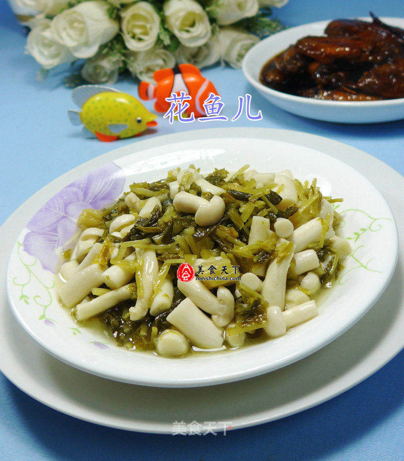

# 雪菜炒海鲜菇

## 📋 基本資訊 / Recipe Overview
- **料理名稱**：雪菜炒海鲜菇
- **原始標題**：雪菜炒海鲜菇
- **素食流派 / Diet**：全素 Vegan
- **料理分類 / Category**：家常蔬食 / 经典热菜
- **來源平台 / Source**：[美食天下 · 精華素食專區](https://home.meishichina.com/recipe-229701.html)

## 🌿 食材及佐料清單 / Ingredients
- 海鲜菇 130克 (主料)
- 雪菜 125克 (主料)
- 盐 适量 (辅料)

## 🍳 烹飪步驟 / Step-by-Step Cooking Steps
1. 食材：海鲜菇（已清洗）、雪菜（已清洗切开）
2. 将已清洗好的海鲜菇放在案板上切开。
3. 烧锅倒油烧热，下入切好海鲜菇翻炒一下。
4. 接着，合入切好的雪菜，加适量的清水。
5. 翻炒翻炒。
6. 然后，加适量的盐。
7. 调味炒匀，即成。

---
*食譜歸檔時間：2026-08-20 · 來源：美食天下 (home.meishichina.com)*