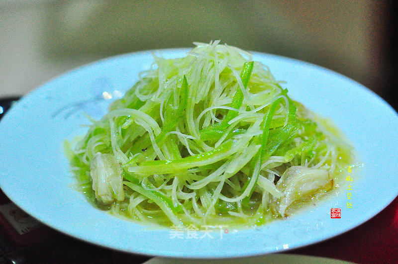

# 青椒土豆丝

## 📋 基本資訊 / Recipe Overview
- **料理名稱**：青椒土豆丝
- **原始標題**：青椒土豆丝
- **素食流派 / Diet**：全素 Vegan
- **料理分類 / Category**：面食主食
- **來源平台 / Source**：[美食天下 · 精華素食專區](https://home.meishichina.com/recipe-232032.html)

## 🌿 食材及佐料清單 / Ingredients
- 土豆 适量 (主料)
- 青椒 适量 (主料)
- 蒜 适量 (辅料)
- 盐 适量 (辅料)
- 生抽 适量 (辅料)
- 麻油 适量 (辅料)
- 淀粉 适量 (辅料)

## 🍳 烹飪步驟 / Step-by-Step Cooking Steps
1. 蒜瓣去皮洗净拍扁
2. 青椒去蒂去籽洗净切丝
3. 土豆去皮，切片
4. 切丝
5. 浸泡在清水中片刻
6. 煮锅加水烧开，放入土豆丝焯烫至断生，沥水捞出.(烧煮时间需根据土豆丝粗细自己掌控)
7. 碗中放适量盐，生抽，淀粉，少量清水调匀
8. 起油锅，放蒜爆香，放入青椒丝，土豆丝快速翻炒，淋上酱汁，少许麻油，收浓汤汁即可
9. 清爽小菜，万能的青椒土豆丝，下饭下酒，给力！
10. 及普通又不普通，及简单又不简单，百搭百变的土豆，开饭啦~~~~~~

---
*食譜歸檔時間：2026-08-20 · 來源：美食天下 (home.meishichina.com)*