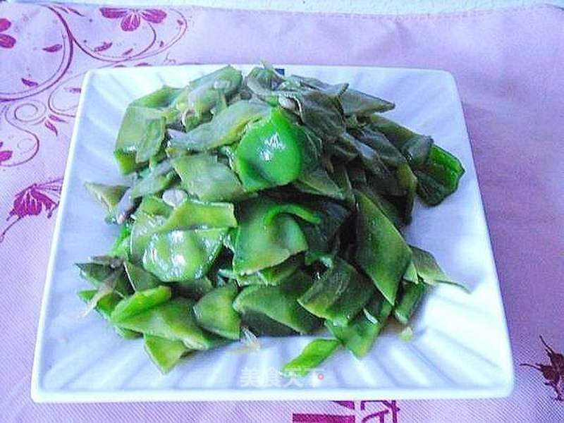

# 青椒炒双豆

## 📋 基本資訊 / Recipe Overview
- **料理名稱**：青椒炒双豆
- **原始標題**：青椒炒双豆
- **素食流派 / Diet**：全素 Vegan
- **料理分類 / Category**：家常蔬食 / 经典热菜
- **來源平台 / Source**：[美食天下 · 精華素食專區](https://home.meishichina.com/recipe-201326.html)

## 🌿 食材及佐料清單 / Ingredients
- 长扁豆 200克 (主料)
- 短扁豆 200克 (主料)
- 青椒 200克 (主料)
- 油 适量 (辅料)
- 盐 适量 (辅料)
- 蚝油 适量 (辅料)
- 味精 适量 (辅料)
- 葱 适量 (辅料)

## 🍳 烹飪步驟 / Step-by-Step Cooking Steps
1. 主辅料：青椒、猪耳朵豆角、驴耳朵豆角
2. 把扁豆洗净、切象眼块。青椒切片，葱切碎。
3. 锅中烧开水，加几滴油、少许盐，放入扁豆汆烫。把扁豆焯熟。捞出过冷水。
4. 起锅热油，爆香葱花。
5. 放入扁豆。翻炒均匀。
6. 放入青椒。
7. 炒匀后，加入蚝油。
8. 加盐、味精调味。翻炒均匀，关火。
9. 出锅装盘，即可上桌。

---
*食譜歸檔時間：2026-08-20 · 來源：美食天下 (home.meishichina.com)*